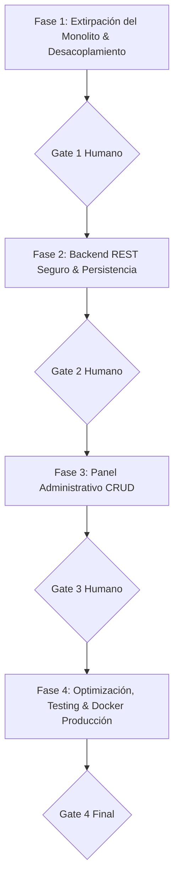

# 🚀 PLAN MAESTRO: REINGENIERÍA LIMPIA Y PANEL CRUD (OPCIÓN A)
## Proyecto: El Bodegón de los Trajes (Tunja, Boyacá)

**Fecha:** 8 de Octubre de 2026  
**Documento Maestro SSOT:** [`agents/.agents/governance/COMPENDIO_SPEC.md`](agents/.agents/governance/COMPENDIO_SPEC.md)  
**Tablero de Seguimiento en Vivo:** [`agents/.agents/governance/TRACKING.md`](agents/.agents/governance/TRACKING.md)  
**Metodología:** Spec-Driven Development (SDD) con Control Humano (Human-in-the-Loop)  

---

## 1. Visión y Objetivos del Proyecto

El objetivo es convertir el repositorio actual en un producto digital de calidad profesional, alta velocidad y máxima seguridad:

1. **Para los Clientes (La Landing Page Pública):**
   - Una experiencia visual inmersiva que exhibe trajes, disfraces, uniformes y vestidos clasificados en **12 temporadas anuales**.
   - Carga ultrarrápida (Core Web Vitals verdes, LCP < 1.2s).
   - Conversión directa mediante botones flotantes y llamados a la acción hacia **WhatsApp** (`wa.me`) y formulario de contacto.
2. **Para la Dueña / Administradora (Ana Isabel):**
   - Un **Panel de Administración CRUD moderno, limpio y seguro**, donde pueda gestionar el catálogo (subir fotos, agregar/editar trajes), definir el tema destacado del mes, responder mensajes de clientes y cambiar horarios.
   - **Cero hackeos al DOM:** Se elimina el antipatrón de editar etiquetas en vivo sobre el HTML público. El contenido se almacena de forma estructurada e independiente en `catalogo.json`.

---

## 2. Los 4 Módulos de Gestión Administrativa

```
┌────────────────────────────────────────────────────────────────────────┐
│                   PANEL DE ADMINISTRACIÓN CRUD                         │
├───────────────────┬───────────────────┬────────────────────────────────┤
│ 1. CATÁLOGO       │ 2. TEMPORADAS     │ 3. BANDEJA DE  │ 4. AJUSTES    │
│    DE TRAJES      │    Y HERO         │    LEADS       │    NEGOCIO    │
│                   │                   │                │               │
│ • Crear prenda    │ • Temporada       │ • Mensajes web │ • WhatsApp    │
│ • Subir foto WebP │   activa del mes  │ • Enlace 1-clic│ • Horarios    │
│ • Tallas/descrip. │ • Título Hero     │   a WhatsApp   │ • Dirección   │
│ • Buscador/filtro │ • Lema y badges   │ • Marcar como  │ • Teléfonos   │
│ • Eliminar/editar │                   │   atendido     │               │
└───────────────────┴───────────────────┴────────────────┴───────────────┘
```

### Módulo 1: Catálogo de Trajes y Prendas (El Núcleo)
* **Crear:** Modal sencillo con campos (Nombre, Temporada [Enero a Diciembre], Descripción/Tallas, Subida de foto con previsualización, Estado activo/inactivo).
* **Consultar:** Grilla con fotos WebP, badges por temporada y buscador reactivo en tiempo real.
* **Editar:** Modificación inmediata de campos o cambio de fotografía.
* **Eliminar:** Confirmación defensiva para retirar trajes obsoletos.

### Módulo 2: Temporadas y Destacados (Hero Configurator)
* **Selector de Mes:** Define cuál de las 12 temporadas se despliega por defecto en la página de inicio.
* **Textos del Banner:** Personalización de los textos principales sin tocar archivos HTML.

### Módulo 3: Bandeja de Mensajes y Prospectos (Leads)
* **Bandeja Central:** Registro ordenado de nombres, teléfonos, correos y preguntas de clientes.
* **Respuesta Rápida:** Botón que abre WhatsApp con el cliente y un mensaje pre-cargado:  
  *`"Hola [Nombre], te escribimos de El Bodegón de los Trajes respecto a tu consulta..."`*.

### Módulo 4: Configuración General del Negocio
* Edición del teléfono central de WhatsApp, horarios de apertura y ubicación física en Tunja.

---

## 3. Arquitectura Técnica de la Opción A

### Capa de Datos (Data-Driven Architecture)
* **Antes (Antipatrón):** Parches CSS guardados en `admin-content.js` basados en selectores como `#temporadas > div:nth-child(2) > button:nth-child(1)`.
* **Ahora (Clean Architecture):** Un archivo estructurado `sitio/data/catalogo.json`:
  ```json
  {
    "temporada_activa": "octubre",
    "hero": {
      "titulo": "El Bodegón de los Trajes",
      "subtitulo": "Alta costura en disfraces y trajes de gala en Tunja"
    },
    "trajes": [
      {
        "id": "tr_001",
        "temporada": "octubre",
        "titulo": "Disfraz Bruja Escarlata",
        "descripcion": "Incluye corset, falda y tiara. Tallas S, M, L.",
        "foto": "assets/img/horror_bg.webp",
        "tallas": ["S", "M", "L"],
        "activo": true
      }
    ]
  }
  ```

### Capa de Presentación (Frontend)
* `sitio/index.html`: Marcado limpio y semántico.
* `sitio/js/catalog-renderer.js`: Script de apenas 100-150 líneas que lee `catalogo.json` y dibuja las tarjetas en el DOM con transiciones elegantes y `loading="lazy"`.
* `sitio/admin/`: Interfaz administrativa privada, responsiva y desacoplada del sitio público.

### Capa de Backend y Servicios (PHP 8.3 REST API)
* `/api/auth`: Manejo de sesiones seguras (`HttpOnly`, `SameSite=Lax`), prevención de fuerza bruta y CSRF tokens. Cero contraseñas en cliente.
* `/api/catalogo`: Endpoint REST (GET público, POST/PUT/DELETE autenticados con bloqueo `LOCK_EX`).
* `/api/upload-media`: Validación estricta con `finfo_file`, compresión WebP y nombres criptográficos únicos.
* `/api/leads`: Consulta y administración de prospectos fuera del control de versiones de Git.

---

## 4. Plan de Ejecución Secuencial (4 Fases, 15 Tareas)



### 🛡️ Fase 1: Extirpación del Monolito & Desacoplamiento (Prioridad Inmediata)
1. **TSK-01:** Extraer los 65+ trajes existentes al archivo estructurado `sitio/data/catalogo.json` sin perder fotos ni descripciones.
2. **TSK-02:** Erradicar de raíz el archivo `sitio/js/admin.js` (5.123 líneas) y la contraseña en texto plano `ANAISABEL2026`.
3. **TSK-03:** Implementar `sitio/js/catalog-renderer.js` para pintar el catálogo desde el JSON.

### 🔐 Fase 2: Backend REST Seguro & Persistencia Robusta
4. **TSK-04:** Configurar `/api/auth.php` con credenciales en variables de entorno y hash bcrypt.
5. **TSK-05:** Implementar `/api/catalogo.php` con operaciones CRUD y bloqueo exclusivo `LOCK_EX`.
6. **TSK-06:** Implementar `/api/upload-media.php` con validación MIME y conversión automática a WebP.
7. **TSK-07:** Implementar `/api/leads.php` para consulta segura de prospectos.

### 🎨 Fase 3: Panel Administrativo CRUD (Los 4 Módulos)
8. **TSK-08:** Maquetar la pantalla de Login y el Layout base del panel administrativo.
9. **TSK-09:** Desarrollar el **Módulo 1: CRUD de Trajes** (formulario modal, subida de foto, buscador).
10. **TSK-10:** Desarrollar el **Módulo 2: Temporada Activa y Hero**.
11. **TSK-11:** Desarrollar el **Módulo 3: Bandeja de Leads** con botón a WhatsApp.
12. **TSK-12:** Desarrollar el **Módulo 4: Horarios y Configuración**.

### 🚀 Fase 4: Optimización, Testing y Despliegue en Producción
13. **TSK-13:** Auditoría Core Web Vitals (Lighthouse > 90, LCP < 1.2s, 0 errores en consola).
14. **TSK-14:** Ejecutar suite automatizada de pruebas de integración en `scripts/`.
15. **TSK-15:** Verificación final en el contenedor Docker en puerto 8095 y pase a producción.

---

## 5. Próximo Paso Inmediato

Iniciar la **Fase 1 (TSK-01)**:
- Generar el script de extracción que lea el catálogo actual y lo consolide limpiamente en `sitio/data/catalogo.json`.
- Remover de forma limpia `admin.js` del cliente.
