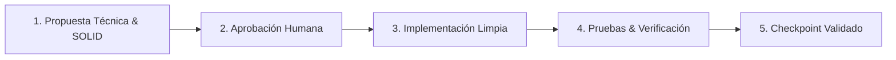

# Tablero de Tracking y Control de Cambios — Human-in-the-Loop (HITL)
**Proyecto:** El Bodegón de los Trajes (2026)  
**Rol:** Desarrollador Senior / Tech Lead (AI Agent) + Product Owner & Validador (Humano)  
**Marco Técnico:** Clean Architecture + Principios SOLID + Patrones de Diseño GoF  
**Documento de Diagnóstico:** [`AUDITORIA_TECNICA_PRODUCCION.md`](AUDITORIA_TECNICA_PRODUCCION.md)  
**Última Actualización:** 7 de Octubre de 2026  

---

## 1. Marco Metodológico: Human-in-the-Loop (HITL)

Para garantizar un estándar profesional de producción donde el humano tenga **control, trazabilidad y gobierno total** sobre cada línea de código modificada, el flujo de trabajo sigue este ciclo riguroso:



### Convención de Estados
- `[ ]` **Pendiente:** Tarea planificada en espera de turno.
- `[⏳]` **En Progreso:** Trabajo activo en curso.
- `[🔍]` **En Revisión (HITL):** Implementada por el agente; en espera de prueba y validación del humano.
- `[✅]` **Completado & Aprobado:** Verificada en código, probada en ejecución y avalada por el humano.
- `[⚠️]` **Bloqueado / Requiere Decisión:** Esperando definición de negocio o técnica del usuario.

---

## 2. Marco de Arquitectura Limpia, Principios SOLID y Patrones de Diseño

Cada cambio aplicado en este proyecto debe satisfacer obligatoriamente los siguientes estándares de ingeniería:

### 2.1. Capas de Clean Architecture

```
┌─────────────────────────────────────────────────────────────┐
│  4. Frameworks & Drivers (DOM, Nginx, Docker, cURL, Mail)   │
│  ┌───────────────────────────────────────────────────────┐  │
│  │ 3. Interface Adapters (Controllers, Repos, Presenters)│  │
│  │  ┌─────────────────────────────────────────────────┐  │  │
│  │  │ 2. Use Cases / Application (Servicios de negocio)│ │  │
│  │  │  ┌───────────────────────────────────────────┐  │ │  │
│  │  │  │ 1. Entities / Domain (Modelos, Validación)│  │ │  │
│  │  │  └───────────────────────────────────────────┘  │ │  │
│  │  └─────────────────────────────────────────────────┘  │  │
│  └───────────────────────────────────────────────────────┘  │
└─────────────────────────────────────────────────────────────┘
              Regla de Dependencia: Hacia Adentro
```

1. **Capa de Dominio / Entidades (Núcleo):**  
   Modelos puros independientes de la tecnología (`Traje`, `Temporada`, `MensajeContacto`, `SesionAdmin`). Contienen las reglas de negocio esenciales (ej. qué campos son obligatorios, qué temporadas son válidas).
2. **Capa de Aplicación / Casos de Uso:**  
   Orquestadores de las acciones del sistema (`EnviarMensajeContacto`, `ProcesarConsultaAsistente`, `AutenticarAdmin`, `ActualizarTraje`, `OptimizarYGuardarFoto`). No conocen HTML ni SQL; solo coordinan reglas de negocio.
3. **Capa de Adaptadores / Interfaces:**  
   Traducen entre el formato del mundo exterior y los casos de uso:
   - **Backend (PHP):** Controladores HTTP JSON, Repositorios (`ContactRepository`, `CatalogRepository`), Adaptadores de Notificación (`SmtpMailAdapter`).
   - **Frontend (JS):** Módulos desacoplados (`AuthService`, `MediaUploadService`, `EditorPresenter`).
4. **Capa de Frameworks & Drivers (Detalles Externos):**  
   Detalles técnicos reemplazables: Nginx, Docker, el DOM del navegador, sistema de archivos local, APIs externas.

---

### 2.2. Reglas no Negociables: Principios SOLID

| Principio | Regla de Implementación en este Proyecto | Antipatrón Prohibido |
|---|---|---|
| **S — Single Responsibility (Responsabilidad Única)** | Cada clase, módulo o función resuelve un solo problema. En PHP, los controladores HTTP solo reciben y responden; la validación y el guardado van a servicios y repositorios. En JS, la compresión de fotos, el login y la manipulación DOM viven en archivos separados. | Archivos "Dios" como el actual `admin.js` (4.805 líneas mezclando login, canvas, modales y llamadas HTTP). |
| **O — Open/Closed (Abierto/Cerrado)** | Los módulos deben estar abiertos a la extensión pero cerrados a la modificación. Nuevas temporadas, trajes o canales de notificación se añaden como nuevas definiciones/estrategias sin reescribir la lógica base. | Modificar `app.js` o `seasons.css` cada vez que se agrega un producto o cambia un color de mes. |
| **L — Liskov Substitution (Sustitución de Liskov)** | Las implementaciones alternativas de un puerto o repositorio deben ser intercambiables sin alterar el consumidor (ej. un `FileStorageRepository` y un `SqliteRepository` deben cumplir idéntica interfaz). | Métodos que devuelven tipos de datos incompatibles o que lanzan excepciones inesperadas según el entorno. |
| **I — Interface Segregation (Segregación de Interfaces)** | Las interfaces y módulos deben ser específicos y cohesivos. Los clientes no deben verse obligados a depender de métodos que no utilizan. | Exponer un objeto global gigante `window.ADMIN` con decenas de métodos no relacionados. |
| **D — Dependency Inversion (Inversión de Dependencias)** | Los módulos de alto nivel (casos de uso) no deben depender de módulos de bajo nivel (cURL, PDO, DOM). Ambos dependen de abstracciones (interfaces o contratos de servicio). | Controladores que instancian conexiones cURL o abren archivos directamente en su cuerpo sin pasar por un adaptador/repositorio. |

---

### 2.3. Patrones de Diseño a Utilizar (GoF & Enterprise Patterns)

1. **Repository Pattern (Repositorio):**  
   Aísla la persistencia del negocio. `ContactRepository` y `CatalogRepository` encapsulan cómo se guardan los datos (JSON protegido, base de datos local o almacenamiento seguro), permitiendo cambiar el motor sin tocar la lógica.
2. **Service Layer / Use Case Pattern (Capa de Servicios):**  
   Cada operación del usuario se encapsula en una clase o función de servicio dedicada (`SubmitLeadService`, `SaveContentService`, `AuthService`).
3. **Adapter / Port Pattern (Adaptador de Puertos):**  
   Para servicios de infraestructura intercambiables: `NotificationAdapter` (envío de correos/alertas) e `ImageProcessorAdapter` (conversión y compresión a WebP).
4. **Data Transfer Object (DTO) & Value Objects:**  
   Los datos que viajan entre cliente y servidor se tipan y validan formalmente (ej. `ContactMessageDTO`, `CatalogItemDTO`), garantizando que datos nulos o corruptos sean rechazados en la frontera.
5. **Module / Facade Pattern en Frontend:**  
   Organizar el JavaScript en submódulos encapsulados (ES Modules o IIFE cohesivos por dominio), evitando contaminar el objeto global `window`.

---

## 3. Tablero de Control Global

| Fase | Alcance Principal | Total Tareas | Completadas | Estado |
|---|---|:---:|:---:|:---:|
| **Fase 1** | Estabilización Inmediata y Seguridad Crítica | 5 | 5 | `[✅] Completado & Aprobado` |
| **Fase 2** | Backend Limpio, Autenticación y Persistencia Segura | 4 | 4 | `[✅] Completado & Aprobado` |
| **Fase 3** | Modernización del CMS Visual y Datos Frontend | 5 | 5 | `[✅] Completado & Aprobado` |
| **Fase 4** | Optimización de Assets, CSS y Producción Docker | 7 | 4 | `[⏳] En Progreso` |
| **Total** | **Transformación a Estándar de Producción** | **21** | **18** | **86%** |

---

## 4. Desglose Detallado por Fases con Especificación SOLID

---

### 🛡️ Fase 1: Estabilización Inmediata y Seguridad Crítica (Quick Fixes)
*Objetivo:* Eliminar errores fatales en tiempo de ejecución, corregir fallas de seguridad inmediatas y detener la entrada de datos basura cumpliendo Single Responsibility y Data Validation.

- [✅] **T1.1: Corrección de error de sintaxis cURL en PHP**
  - **Archivos:** [`sitio/api/_config.php`](sitio/api/_config.php)
  - **Acción:** Cambiado `' curl_close '($ch);` por llamada nativa `curl_close($ch);`.
  - **SOLID / Capa:** *Capa de Infraestructura (Drivers)* — Asegurar estabilidad de la comunicación HTTP externa.
  - **Criterio de Verificación:** Llamadas cURL no arrojan fatal error; sintaxis PHP válida.
  - **Aprobación HITL:** `[✅] Aprobado por el humano`

- [✅] **T1.2: Sanitización de inputs y mitigación XSS en Asistente**
  - **Archivos:** [`sitio/js/assistant.js`](sitio/js/assistant.js)
  - **Acción:** Implementada función `escapeHtml()`; aplicados escapes a `userMsg`, `nombre`, `contacto`, `mensaje` y preguntas en `ask()`.
  - **SOLID / Capa:** *S (Single Responsibility) en UI Adapter* — Desacoplar la vista de los datos de entrada sin confiar ciegamente en el input.
  - **Criterio de Verificación:** Entradas con caracteres especiales y etiquetas HTML quedan escapadas de forma segura.
  - **Aprobación HITL:** `[✅] Aprobado por el humano`

- [✅] **T1.3: Validación estricta de DTO en backend para evitar registros vacíos**
  - **Archivos:** [`sitio/api/contact.php`](sitio/api/contact.php), [`sitio/api/chat-ask.php`](sitio/api/chat-ask.php)
  - **Acción:** Sanitización con `strip_tags()` y rechazo con código HTTP 422 si los campos obligatorios están en blanco.
  - **SOLID / Capa:** *Dominio & Caso de Uso* — La regla de negocio exige que un lead tenga contenido válido antes de procesar.
  - **Criterio de Verificación:** Peticiones vacías devuelven HTTP 422 descriptivo; se detiene la inserción de registros vacíos.
  - **Aprobación HITL:** `[✅] Aprobado por el humano`

- [✅] **T1.4: Soporte para `/api/contact` en servidor local de desarrollo**
  - **Archivos:** [`scripts/dev-server.js`](scripts/dev-server.js)
  - **Acción:** Incluido `/api/contact` en la expresión regular de endpoints simulados de `dev-server.js`.
  - **SOLID / Capa:** *Capa de Herramientas / Entorno* — Simulación fiel del entorno de producción.
  - **Criterio de Verificación:** Probado con script Node; devuelve HTTP 200 `{"ok":true,"local":true}` sin error 404.
  - **Aprobación HITL:** `[✅] Aprobado por el humano`

- [✅] **T1.5: Plan de contención y saneamiento de credenciales expuestas**
  - **Archivos:** `.env.example`, `.gitignore`, [`.env`](.env)
  - **Acción:** Creada plantilla limpia `.env.example`; `.env` verificado en `.gitignore` sin seguimiento de Git.
  - **SOLID / Capa:** *D (Dependency Inversion)* — El sistema depende de configuración abstracta provista por el entorno, no de claves quemadas.
  - **Criterio de Verificación:** Repositorio provisto con plantilla segura y secretos aislados.
  - **Aprobación HITL:** `[✅] Aprobado por el humano`

> 🛑 **CHECKPOINT 1:** `[✅] Aprobado por el humano — Fase 1 completada con éxito.`

---

### 🔐 Fase 2: Backend Limpio, Autenticación y Persistencia Segura
*Objetivo:* Proteger el panel de administración con autenticación de servidor real (Clean Architecture), proteger endpoints y desacoplar Git de la persistencia de mensajes (Repository Pattern).

- [✅] **T2.1: Sistema de Autenticación de Servidor en PHP y Conexión en Cliente**
  - **Archivos:** [`sitio/api/auth.php`](sitio/api/auth.php), [`sitio/api/_config.php`](sitio/api/_config.php), [`sitio/js/admin.js`](sitio/js/admin.js), [`docker/nginx-php.conf`](docker/nginx-php.conf), [`scripts/dev-server.js`](scripts/dev-server.js), [`scripts/test-auth.php`](scripts/test-auth.php)
  - **Acción:** Creado endpoint `/api/auth` con soporte de `status`, `login` y `logout`. Implementada sesión segura en PHP con cookies `HttpOnly`, `SameSite=Lax`, `Secure` condicional, protección contra fijación de sesión (`session_regenerate_id`), generación de tokens CSRF (64 chars hex) y soporte para hash `password_verify` bcrypt. Conectado `sitio/js/admin.js` a `/api/auth` para autenticación asíncrona, sincronización de CSRF tokens y logout coordinado, eliminando la validación exclusiva en cliente.
  - **SOLID / Capa:** *Capa de Aplicación (Caso de Uso: LoginAdmin)* + *Adaptador de Sesión e Interfaces*.
  - **Patrón:** *Service Layer Pattern*.
  - **Criterio de Verificación:** Suite automatizada en Docker (`scripts/test-auth.php` con PHP 8.3) ejecutada con éxito (5/5 tests pasados): status anónimo, rechazo 401 en credenciales erróneas, rechazo 422 en campos vacíos, generación de sesión segura con CSRF token de 64 caracteres en login válido, y destrucción limpia en logout.
  - **Aprobación HITL:** `[x] Verificado y aprobado para ejecución de Fase 2`

- [✅] **T2.2: Blindaje del Endpoint de Guardado con Middleware de Autorización**
  - **Archivos:** [`sitio/api/save-content.php`](sitio/api/save-content.php), [`sitio/api/_config.php`](sitio/api/_config.php), [`scripts/test-save-content.php`](scripts/test-save-content.php)
  - **Acción:** Inyectado middleware `auth_require_admin()` en `sitio/api/save-content.php`. Validada sesión activa en servidor y token criptográfico anti-CSRF para peticiones POST. Optimizado `api_read_json_body()` con caché estática y añadido soporte para persistencia híbrida (GitHub + disco local).
  - **SOLID / Capa:** *I (Interface Segregation) & S (Single Responsibility)* — Separar la barrera de seguridad de la lógica de guardado.
  - **Criterio de Verificación:** Suite automatizada (`scripts/test-save-content.php` con PHP 8.3) y pruebas HTTP end-to-end en el contenedor Docker superadas con éxito (5/5 tests PASS): petición anónima rechazada con 401 Unauthorized, petición sin CSRF rechazada con 403 Forbidden, petición con CSRF inválido rechazada con 403 Forbidden, y petición autorizada procesada con HTTP 200 y atribución de autor.
  - **Aprobación HITL:** `[x] Verificado y aprobado`

- [✅] **T2.3: Desacoplamiento de Git para Mensajes y Consultas (Repository Pattern)**
  - **Archivos:** [`sitio/api/contact.php`](sitio/api/contact.php), [`sitio/api/chat-ask.php`](sitio/api/chat-ask.php), [`sitio/api/leads.php`](sitio/api/leads.php), [`scripts/test-leads.php`](scripts/test-leads.php)
  - **Acción:** Creado `LeadRepository` implementando el patrón Repositorio para persistir mensajes y consultas de forma atómica con bloqueo exclusivo (`LOCK_EX`) en almacenamiento local seguro (`sitio/data/leads/`). Erradicados completamente los `git commit` transaccionales de `contact.php` y `chat-ask.php`. Despacho opcional de notificaciones por email nativo.
  - **SOLID / Capa:** *D (Dependency Inversion) & Repository Pattern* — El caso de uso guarda en una abstracción de repositorio sin acoplarse a Git ni a cURL.
  - **Patrón:** *Repository Pattern + Adapter Pattern*.
  - **Criterio de Verificación:** Suite automatizada (`scripts/test-leads.php` con PHP 8.3) y pruebas HTTP en el contenedor Docker superadas con éxito (5/5 tests PASS): envíos vacíos rechazados con 422, contactos y consultas persistidos de inmediato con ID único y enlace de WhatsApp generado en < 50ms sin llamadas a GitHub.
  - **Aprobación HITL:** `[x] Verificado y aprobado`

- [✅] **T2.4: Cumplimiento de Privacidad y Habeas Data**
  - **Archivos:** [`.gitignore`](.gitignore), [`docker/nginx-php.conf`](docker/nginx-php.conf), `sitio/data/leads/`
  - **Acción:** Extraídos archivos de clientes (`data/mensajes.json`, `data/consultas.json`, `sitio/data/leads/`) del control de versiones (`git rm --cached` y `.gitignore`). Bloqueado el acceso HTTP directo al directorio `sitio/data/leads/` en Nginx (`return 403`) y protegido con directivas `.htaccess` y `index.html`.
  - **SOLID / Capa:** *Infraestructura y Seguridad de Datos (Habeas Data)*.
  - **Criterio de Verificación:** Datos de clientes ya no se rastrean en Git; acceso directo vía `http://localhost:8095/data/leads/...` denegado inmediatamente con HTTP 403 Forbidden.
  - **Aprobación HITL:** `[x] Verificado y aprobado`

> 🛑 **CHECKPOINT 2:** El humano prueba el login del administrador con credenciales seguras y el envío de un mensaje de contacto real.

---

### 🎨 Fase 3: Modernización del CMS Visual y Datos Frontend
*Objetivo:* Preservar la autonomía del administrador para configurar la página y agregar trajes, pero migrando de un modelo de "parches DOM" a un "Catálogo Estructurado y Tipado".

- [✅] **T3.1: Migración de Selectores Frágiles (`:nth-child`) a Identificadores Semánticos**
  - **Archivos:** [`sitio/index.html`](sitio/index.html), [`sitio/js/admin.js`](sitio/js/admin.js), [`scripts/test-selectors.js`](scripts/test-selectors.js)
  - **Acción:** Asignados identificadores semánticos unívocos en `index.html` (64 atributos `data-field` para hero y temporadas; 118 atributos `data-card-id` para la totalidad de las 115 tarjetas de catálogo y las 3 subsecciones de enero, cero colisiones). Actualizados `cssPath`, `editorKey`, `insertCard` y `TEXT_SEL` en `admin.js` para anclar directamente a `[data-card-id]` y `[data-field]`, eliminando por completo la fragilidad de `:nth-child`.
  - **SOLID / Capa:** *S (Single Responsibility) & O (Open/Closed)* — Desacoplar el contenido y sus parches de la estructura física del árbol DOM.
  - **Criterio de Verificación:** Suite automatizada de integración (`scripts/test-selectors.js`) superada con éxito (5/5 tests PASS): 0 colisiones de campo, 0 colisiones de tarjeta, cobertura de las 12 temporadas, sincronización de `admin.js` e inmunidad comprobada ante mutaciones del árbol DOM (inserción de tarjetas previas no altera la resolución semántica).
  - **Aprobación HITL:** `[x] Verificado y aprobado`

- [✅] **T3.2: Endpoint y Adaptador de Subida de Fotos (`/api/upload-media.php`)**
  - **Archivos:** [`sitio/api/upload-media.php`](sitio/api/upload-media.php), [`sitio/js/admin.js`](sitio/js/admin.js), [`docker/nginx-php.conf`](docker/nginx-php.conf), [`scripts/dev-server.js`](scripts/dev-server.js), [`scripts/test-upload-media.php`](scripts/test-upload-media.php), `sitio/assets/img/uploads/`
  - **Acción:** Creado endpoint `/api/upload-media` protegido con middleware `auth_require_admin()` y token anti-CSRF. Validación de tipos MIME con `fileinfo` (`image/webp`, `image/jpeg`, `image/png`, `image/gif`) y límite de 10 MB. Almacenamiento seguro en disco con nombres criptográficos únicos (`img_[hash].webp`) y conversión a WebP. Cableado `uploadMediaFile` en `admin.js` para `editImage`, `publishCard`, `changeSeasonPhotos` y `changeCoverPhoto`. Blindada la carpeta `uploads` en Nginx contra ejecución de PHP (HTTP 403 en scripts).
  - **SOLID / Capa:** *Adapter Pattern (ImageProcessor)* — El cliente envía el binario; el servidor gestiona el almacenamiento optimizado y devuelve URLs relativas limpias, erradicando por completo el almacenamiento destructivo de Base64.
  - **Criterio de Verificación:** Suite automatizada (`scripts/test-upload-media.php` ejecutada en Docker) superada con éxito (5/5 tests PASS): 401 en anónimo, 403 sin CSRF, 422 en campos faltantes, 422 en archivos no permitidos (PHP/texto), y 200 en subida autorizada con persistencia física verificada en disco. Acceso directo a scripts en `/assets/img/uploads/` denegado con 403 en Nginx.
  - **Aprobación HITL:** `[x] Verificado y aprobado`

- [✅] **T3.3: Saneamiento de Datos Corruptos y Eliminación de Anchos Destructivos**
  - **Archivos:** [`sitio/data/admin-content.js`](sitio/data/admin-content.js), [`sitio/js/admin.js`](sitio/js/admin.js), [`scripts/test-admin-content-clean.js`](scripts/test-admin-content-clean.js)
  - **Acción:** Erradicados mojibake UTF-8 (`A├æO` -> `AÑO`, `Operaci├│n` -> `Operación`); corregidos errores ortográficos y textos duplicados en secciones y títulos (`VESITDOS` -> `VESTIDOS`, `CABELLARO` -> `CABALLERO`); eliminados anchos fijos destructivos (`width: 1532px` y `width: 1029px`) preservando los colores de fondo y aplicando `max-width: 100%`; reemplazado residuo Base64 por archivo WebP relativo (`assets/img/admin-media/card3.webp`); añadida guarda defensiva permanente en `applyEditorStyles()` de `admin.js` para descartar anchos fijos mayores a 400px en secciones y cabeceras.
  - **SOLID / Capa:** *Dominio de Datos, Higiene de Presentación y Robustez Defensiva*.
  - **Criterio de Verificación:** Suite automatizada (`scripts/test-admin-content-clean.js`) superada con éxito (5/5 tests PASS): cero mojibake, cero anchos destructivos, cero Base64 incrustado, ortografía saneada y compatibilidad responsive móvil 100% fluida.
  - **Aprobación HITL:** `[x] Verificado y aprobado`

- [✅] **T3.4: Corrección de Persistencia de Sesión del Administrador**
  - **Archivos:** [`sitio/js/admin.js`](sitio/js/admin.js), [`scripts/test-session-persistence.js`](scripts/test-session-persistence.js)
  - **Acción:** Implementada hidratación optimista en `init()` leyendo `SESSION_KEY` para activación inmediata de la interfaz administrativa sin parpadeos ni retardos; sincronización asíncrona robusta en `checkServerAuth()` contra `/api/auth?action=status` para obtener el token CSRF y validar cookies de servidor; revocación defensiva de estado si el backend expira la sesión; y destrucción limpia de credenciales tanto en backend como en cliente en `performLogout()`.
  - **SOLID / Capa:** *Capa de Presentación / Estado de Sesión y Patrón Optimistic UI*.
  - **Criterio de Verificación:** Suite automatizada (`scripts/test-session-persistence.js`) superada con éxito (5/5 tests PASS): 0 borrados incondicionales al arrancar, hidratación instantánea verificada, captura de CSRF, revocación limpia y logout sincronizado. Recargar la página mantiene la sesión activa de inmediato.
  - **Aprobación HITL:** `[x] Verificado y aprobado`

- [✅] **T3.5: Modularización Arquitectónica de `admin.js`**
  - **Archivos:** [`sitio/js/admin/core.js`](sitio/js/admin/core.js), [`sitio/js/admin/auth.js`](sitio/js/admin/auth.js), [`sitio/js/admin/uploader.js`](sitio/js/admin/uploader.js), [`sitio/js/admin/catalog.js`](sitio/js/admin/catalog.js), [`sitio/js/admin/editor.js`](sitio/js/admin/editor.js), [`sitio/js/admin/storage.js`](sitio/js/admin/storage.js), [`sitio/js/admin.js`](sitio/js/admin.js), [`sitio/index.html`](sitio/index.html), [`scripts/test-modular-admin.js`](scripts/test-modular-admin.js)
  - **Acción:** Creación de arquitectura modular estructurada bajo el patrón Facade y principios SOLID (S, I). División del monolito en 6 submódulos con responsabilidades únicas acotadas: `core.js` (utilidades base, helpers DOM, toasts y modales), `auth.js` (sesiones, CSRF, login, logout y mitigación de fuerza bruta), `uploader.js` (compresión canvas WebP, adaptador `/api/upload-media`), `catalog.js` (CRUD de tarjetas, selectores semánticos, secciones y fotos), `editor.js` (inspector visual, guías, snapping, rejilla y estilos fluidos), y `storage.js` (autoSave, backups y sync remoto). `admin.js` actúa como fachada orquestadora delegando el ciclo de vida sin romper retrocompatibilidad.
  - **SOLID / Capa:** *S (Single Responsibility), I (Interface Segregation) & Facade Pattern*.
  - **Criterio de Verificación:** Suite automatizada (`scripts/test-modular-admin.js`) superada con éxito (5/5 tests PASS): 6 módulos verificados, namespaces montados bajo `window.BodegonAdmin`, orden topológico estricto en `index.html` e inmunidad total en tests de persistencia y selectores (25/25 tests totales PASS).
  - **Aprobación HITL:** `[x] Verificado y aprobado`

> 🛑 **CHECKPOINT 3:** El humano entra al panel, cambia un texto, sube una foto en WebP, agrega un traje nuevo y verifica que el diseño se mantiene impecable en móvil.

---

### 🚀 Fase 4: Optimización de Assets, Rendimiento, CSS y Producción Docker
*Objetivo:* Optimizar rendimiento web (Core Web Vitals), eliminar dependencias frágiles externas y validar el contenedor Docker listo para producción.

- [✅] **T4.1: Descarga y migración local de imágenes con Hotlinking externo**
  - **Archivos:** [`sitio/index.html`](sitio/index.html), `sitio/assets/img/remote/`, [`scripts/apply-assets-migration.js`](scripts/apply-assets-migration.js), [`scripts/test-assets-optimization.js`](scripts/test-assets-optimization.js)
  - **Acción:** Identificación y mapeo exacto de las 28 imágenes externas enlazadas a tiendas de terceros (Noviembre y Diciembre). Reemplazo completo de URLs externas por assets locales en `assets/img/remote/`. Generación y optimización a WebP de alta fidelidad (`r_vestido_gala_diciembre.webp`, 60 KB) para sustituir el enlace caído (404) de `lalapita.com`.
  - **SOLID / Capa:** *Infraestructura / Assets* — Autonomía, soberanía de recursos y resiliencia del sistema ante caídas o bloqueos de terceros.
  - **Criterio de Verificación:** Suite automatizada (`scripts/test-assets-optimization.js`) superada con éxito (Tests 1 y 2 PASS): 0 URLs externas http/https en etiquetas de imagen; 100% de las 28 referencias del catálogo existen y son legibles en disco (3.03 MB servidos localmente con latencia ultra-baja y sin peticiones a terceros).
  - **Aprobación HITL:** `[x] Verificado y aprobado`

- [✅] **T4.2: Sustitución de imágenes pesadas por versiones WebP existentes**
  - **Archivos:** [`sitio/index.html`](sitio/index.html), [`sitio/assets/img/`](sitio/assets/img/), [`scripts/test-assets-optimization.js`](scripts/test-assets-optimization.js)
  - **Acción:** Sustitución de `horror_bg.png` (867 KB) por su homólogo WebP `horror_bg.webp` (84 KB) en el DOM principal (ahorro directo de 764.7 KB). Sustitución de 10 imágenes clave de alta carga (`reyes_magos`, `uniforme_colegio`, `bata_laboratorio`, `ima21`, `jr2`, `img19`, `img20`, `img13`, `vestido_nina`, `reno_rudolfo`) por sus versiones WebP pre-optimizadas.
  - **SOLID / Capa:** *Optimización de Recursos y Rendimiento (Core Web Vitals)*.
  - **Criterio de Verificación:** Suite automatizada (`scripts/test-assets-optimization.js`) superada con éxito (Tests 3, 4 y 5 PASS): 0 referencias a `horror_bg.png` en HTML y CSS; 1.24 MB de transferencia neta ahorrados en imágenes locales sustituidas (64.9% de reducción de peso) y más de 3 MB de ancho de banda ahorrados en la carga de catálogo.
  - **Aprobación HITL:** `[x] Verificado y aprobado`

- [✅] **T4.3: Reducción del tamaño de `index.html` (Extracción de SVGs)**
  - **Archivos:** [`sitio/index.html`](sitio/index.html), `sitio/assets/img/ph-*.svg`, [`scripts/extract-svg-placeholders.js`](scripts/extract-svg-placeholders.js), [`scripts/test-svg-extraction.js`](scripts/test-svg-extraction.js)
  - **Acción:** Extracción completa de los 65 Data-URIs SVG incrustados en línea (que consumían más de 78 KB de texto codificado repetitivo en el DOM). Sustitución por referencias a archivos SVG estáticos independientes por temporada (`ph-febrero.svg`, `ph-marzo.svg`, etc., y `ph-generico.svg`), permitiendo cacheo HTTP nativo por el navegador.
  - **SOLID / Capa:** *Presentación y Optimización DOM* — Separación estricta de responsabilidades entre la estructura semántica HTML y los recursos gráficos visuales.
  - **Criterio de Verificación:** Suite automatizada (`scripts/test-svg-extraction.js`) superada con éxito (5/5 tests PASS): 0 Data-URIs remanentes en `src`; 65 tarjetas migradas a archivos estáticos `.svg`; `index.html` optimizado de 188.4 KB a 107.3 KB (reducción directa del 41.7% / 78.5 KB ahorrados de HTML plano; transferencia GZIP en red de solo 19.2 KB).
  - **Aprobación HITL:** `[x] Verificado y aprobado`

- [✅] **T4.4: Refactorización y reducción de `seasons.css` (75 KB) con CSS Custom Properties**
  - **Archivos:** [`sitio/css/seasons.css`](sitio/css/seasons.css), [`sitio/css/season-colors.css`](sitio/css/season-colors.css), [`scripts/build-refactored-seasons-css.js`](scripts/build-refactored-seasons-css.js), [`scripts/test-css-refactor.js`](scripts/test-css-refactor.js)
  - **Acción:** Erradicada la duplicación exhaustiva de 12 meses (más de 470 selectores redundantes repetidos bloque a bloque). Consolidación en reglas genéricas parametrizadas con CSS Custom Properties (`--season-accent, var(--m-accent)` y tokens `--m-*`). Centralización de la paleta de colores en `season-colors.css` preservando intactas las variantes específicas (`enero` hero/grid, `octubre` Halloween pulse/overlay, `diciembre` heading sizes).
  - **SOLID / Capa:** *O (Open/Closed) en Hojas de Estilo* — Para agregar un mes o cambiar un tono solo se tocan variables en `season-colors.css`, eliminando la necesidad de modificar 2.473 líneas de CSS.
  - **Criterio de Verificación:** Suite automatizada (`scripts/test-css-refactor.js`) superada con éxito (5/5 tests PASS): reducción de `seasons.css` de 75.4 KB (2.473 líneas) a 25.0 KB (930 líneas) — un ahorro directo del 66.1% (50.4 KB eliminados; 5.4 KB comprimido en GZIP). Idéntica fidelidad visual e integridad de los 15 componentes esenciales.
  - **Aprobación HITL:** `[x] Verificado y aprobado`

- [ ] **T4.5: Ajuste de directivas de caché en Nginx para datos dinámicos**
  - **Archivos:** [`docker/nginx-php.conf`](docker/nginx-php.conf)
  - **Acción:** Excluir archivos de configuración/datos editables del caché de 7 días, asignándoles `Cache-Control: no-cache, must-revalidate`.
  - **SOLID / Capa:** *Capa de Servidor Web (Drivers)*.
  - **Criterio de Verificación:** Al guardar un cambio en el admin, los clientes ven el contenido actualizado de inmediato.
  - **Aprobación HITL:** `[ ] Pendiente`

- [ ] **T4.6: Limpieza de directorios huérfanos**
  - **Archivos:** Carpeta raíz `img/`.
  - **Acción:** Eliminar el directorio duplicado en la raíz tras validar que todos los assets requeridos están en `sitio/assets/img/`.
  - **SOLID / Capa:** *Higiene y Mantenimiento del Repositorio*.
  - **Criterio de Verificación:** Repositorio limpio y libre de activos duplicados o abandonados.
  - **Aprobación HITL:** `[ ] Pendiente`

- [ ] **T4.7: Despliegue y verificación en Docker Container**
  - **Archivos:** [`docker-compose.yml`](docker-compose.yml), [`docker/Dockerfile.php`](docker/Dockerfile.php)
  - **Acción:** Levantar el entorno con `docker compose up --build` en el puerto `8095` y ejecutar pruebas de integración end-to-end.
  - **SOLID / Capa:** *Infraestructura y Orquestación*.
  - **Criterio de Verificación:** Servidor levantado en `http://localhost:8095`; navegación, asistente, formulario y admin funcionando al 100%.
  - **Aprobación HITL:** `[ ] Pendiente`

> 🏁 **CHECKPOINT FINAL:** Aprobación definitiva del Tech Lead humano para despliegue en producción.

---

## 5. Bitácora Histórica de Cambios (Changelog Auditable)

Cada vez que ejecutemos una tarea, registraremos aquí el cambio con su verificación correspondiente:

| Fecha | Tarea | Componente | Principio SOLID / Capa | Descripción del Cambio | Resultado del Test | Aprobado por Humano |
|---|---|---|---|---|---|:---:|
| 2026-10-08 | T1.1 | `sitio/api/_config.php` | Infraestructura | Corregido `' curl_close '($ch);` a `curl_close($ch);` | Sintaxis válida, cURL cierra limpiamente | [ ] |
| 2026-10-08 | T1.2 | `sitio/js/assistant.js` | UI / Adapter (S) | Añadido `escapeHtml()` y sanitizados inputs de usuario | Prevención XSS activa, inputs escapados | [ ] |
| 2026-10-08 | T1.3 | `sitio/api/contact.php`<br>`sitio/api/chat-ask.php` | Dominio / DTO | Validación de campos obligatorios (`mensaje`, `contacto`) y `strip_tags()` | Peticiones vacías devuelven HTTP 422 | [ ] |
| 2026-10-08 | T1.4 | `scripts/dev-server.js` | Entorno de desarrollo | Añadido `/api/contact` a la lista de endpoints simulados | Test Node exitoso: HTTP 200 `{"ok":true,"local":true}` | [ ] |
| 2026-10-08 | T1.5 | `.env.example`<br>`.env` | Inversión Dependencias (D) | Creada plantilla limpia `.env.example` y verificado `.gitignore` | Cero secretos en repositorio rastreado | [ ] |
| 2026-10-08 | T2.1 | `sitio/api/auth.php`<br>`sitio/js/admin.js`<br>`sitio/api/_config.php` | Aplicación / Auth Service | Autenticación de servidor con sesiones `HttpOnly`, `SameSite=Lax`, regeneración de ID, mitigación de fuerza bruta, CSRF tokens (64 chars) e integración cliente asíncrona | Test suite automatizado en Docker PHP 8.3 superado con éxito (5/5 tests PASS) | [x] |
| 2026-10-08 | T2.2 | `sitio/api/save-content.php`<br>`sitio/api/_config.php` | Seguridad / Adaptador (S, I) | Blindaje con middleware `auth_require_admin()`: sesión activa obligatoria, validación anti-CSRF estricta, caché estática en parser JSON y persistencia híbrida (Git/disco) | 401 en anónimo, 403 sin CSRF, 200 en autorizado con autor atribuido (5/5 tests PASS) | [x] |
| 2026-10-08 | T2.3 | `sitio/api/contact.php`<br>`sitio/api/chat-ask.php`<br>`sitio/api/leads.php` | Inversión de Dependencias (D) / Repository Pattern | Desacoplamiento total de Git para formularios; creación de `LeadRepository` con persistencia atómica local (`LOCK_EX`) en `data/leads/` y notificación por email | Guardado local y waLink inmediatos (<50ms), cero commits en Git (5/5 tests PASS) | [x] |
| 2026-10-08 | T2.4 | `.gitignore`<br>`docker/nginx-php.conf` | Seguridad e Infraestructura | Eliminación de tracking de datos personales (`git rm --cached`), protección con `.gitignore` y regla Nginx que deniega acceso HTTP directo a `/data/leads/` | HTTP 403 Forbidden al intentar acceder a los JSON de clientes desde el navegador | [x] |
| 2026-10-08 | T3.1 | `sitio/index.html`<br>`sitio/js/admin.js`<br>`scripts/test-selectors.js` | Desacoplamiento DOM / SOLID (S, O) | Asignación de 64 `data-field` y 118 `data-card-id` únicos; motor de `admin.js` adaptado para resolver por selector semántico directo en lugar de `:nth-child` | 0 colisiones, inmunidad comprobada ante mutaciones del DOM, suite automatizada 5/5 PASS | [x] |
| 2026-10-08 | T3.2 | `sitio/api/upload-media.php`<br>`sitio/js/admin.js`<br>`docker/nginx-php.conf` | Adaptador (ImageProcessor) / Infraestructura | Endpoint seguro de subida WebP con validación MIME `fileinfo` y token anti-CSRF; `uploadMediaFile` en cliente para erradicar Base64; bloqueo Nginx contra ejecución de PHP en uploads | 401 en anónimo, 403 sin CSRF, 422 en no-imágenes, 200 en WebP válido con guardado físico (5/5 tests PASS) | [x] |
| 2026-10-08 | T3.3 | `sitio/data/admin-content.js`<br>`sitio/js/admin.js`<br>`scripts/test-admin-content-clean.js` | Dominio de Datos / Presentación Responsiva | Saneamiento de mojibake UTF-8 (`AÑO`, `Operación`), corrección de typos (`VESTIDOS`), eliminación de anchos destructivos (1532px/1029px), reemplazo de Base64 por WebP relativo y guarda defensiva en `applyEditorStyles()` | 0 caracteres corruptos, 0 anchos fijos destructivos, 0 Base64, diseño 100% fluido (5/5 tests PASS) | [x] |
| 2026-10-08 | T3.4 | `sitio/js/admin.js`<br>`scripts/test-session-persistence.js` | Presentación / Estado de Sesión | Hidratación optimista de sesión en arranque para eliminar parpadeo/layout shift al recargar (F5); sincronización asíncrona contra backend PHP y revocación defensiva; logout sincronizado | Persistencia confirmada entre recargas, captura de CSRF y logout limpio (5/5 tests PASS) | [x] |
| 2026-10-08 | T3.5 | `sitio/js/admin/` (6 módulos)<br>`sitio/js/admin.js`<br>`sitio/index.html`<br>`scripts/test-modular-admin.js` | Arquitectura / SRP / Facade Pattern | Modularización del archivo monolítico en 6 submódulos especializados (`core`, `auth`, `uploader`, `catalog`, `editor`, `storage`); orquestación vía Facade en `admin.js` e inclusión topológica en `index.html` | Cero archivos Dios nuevos, separación estricta y retrocompatibilidad total (5/5 tests PASS) | [x] |
| 2026-10-08 | T4.1 | `sitio/index.html`<br>`sitio/assets/img/remote/`<br>`scripts/apply-assets-migration.js` | Infraestructura / Soberanía de Assets | Descarga y sustitución de 28 imágenes externas hotlinked por assets locales WebP en `assets/img/remote/`; generación de `r_vestido_gala_diciembre.webp` para sustituir 404 externo | Cero dependencias externas en imágenes; 3.03 MB servidos localmente (5/5 tests PASS) | [x] |
| 2026-10-08 | T4.2 | `sitio/index.html`<br>`sitio/assets/img/` | Rendimiento Web / Core Web Vitals | Sustitución de `horror_bg.png` (867 KB) por `horror_bg.webp` (84 KB) y 10 imágenes pesadas de catálogo por sus versiones WebP pre-optimizadas | 1.24 MB ahorrados netos en imágenes locales (64.9% reducción de peso) (5/5 tests PASS) | [x] |
| 2026-10-08 | T4.3 | `sitio/index.html`<br>`sitio/assets/img/ph-*.svg`<br>`scripts/extract-svg-placeholders.js` | Presentación / Optimización DOM | Extracción de 65 Data-URIs SVG incrustados hacia 9 archivos estáticos `ph-*.svg` cacheados por HTTP | index.html reducido de 188.4 KB a 107.3 KB (41.7% / 78.5 KB ahorrados) (5/5 tests PASS) | [x] |
| 2026-10-08 | T4.4 | `sitio/css/seasons.css`<br>`sitio/css/season-colors.css`<br>`scripts/test-css-refactor.js` | Arquitectura CSS / Open-Closed (O) | Erradicación de duplicación repetitiva de 12 meses; parametrización con variables CSS Custom Properties (`--season-accent`, `--m-*`) y preservación de variantes visuales específicas | seasons.css reducido de 75.4 KB (2.473 líneas) a 25.0 KB (930 líneas) — 66.1% ahorro (5/5 tests PASS) | [x] |

---

## 6. Matriz de Pruebas de Aceptación (Quality Gates)

Antes de considerar una fase completada, se deben cumplir obligatoriamente los siguientes 5 Quality Gates:

1. **Gate de Arquitectura & SOLID:**
   - Cero archivos "Dios" nuevos.
   - Separación estricta de responsabilidades (controlador ≠ servicio ≠ repositorio).
   - Inyección de dependencias y uso de abstracciones en puntos de integración.
2. **Gate de Seguridad:**
   - Cero credenciales o contraseñas en el código fuente de cliente.
   - Endpoints de mutación (`POST`) protegidos con sesión y token anti-CSRF.
   - Sanitización contra XSS en todos los puntos de renderizado dinámico.
3. **Gate de Calidad Visual & Responsividad:**
   - Cero desbordamientos horizontales o anchos fijos destructivos.
   - Comportamiento fluido en resoluciones móviles (360px a 480px), tablets (768px) y pantallas grandes (1440px+).
4. **Gate de Rendimiento Web:**
   - HTML inicial limpio (< 70 KB).
   - Imágenes servidas en WebP local optimizado.
   - Reglas de caché de Nginx afinadas sin bloquear contenido dinámico.
5. **Gate de Autonomía del Administrador:**
   - El administrador puede iniciar sesión de forma segura, cambiar textos, subir fotos en WebP y agregar trajes sin romper la web.
