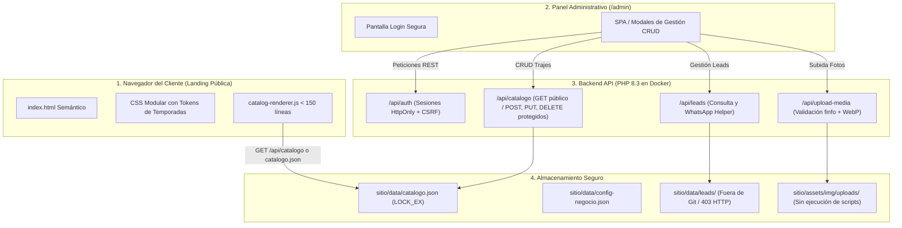

# COMPENDIO MAESTRO DE ESPECIFICACIONES TÉCNICAS & ARQUITECTURA (SSOT)
## PROYECTO: EL BODEGÓN DE LOS TRAJES (TUNJA) — LANDING PAGE & PANEL CRUD

**Autor:** `Bodegon-CTO-Lead` (Director Técnico & Solutions Architect)  
**Metodología:** Spec-Driven Development (SDD) — Human-in-the-Loop (HITL)  
**Rol Humano:** Product Owner, Supervisor Técnico & Aprobador Exclusivo de Fases  
**Rol IA:** Squad Especializado (Backend, Frontend, UI/UX, DevOps, QA & Security, Scrum)  
**Alcance Oficial:** Opción A (Reingeniería Limpia: Desacoplamiento de Datos + Panel Administrativo CRUD Seguro)  
**Estado:** ✅ **Documento Maestro Definitivo (Single Source of Truth - SSOT)**  
**Última Actualización:** 2026-10-08  

---

## ÍNDICE GENERAL

1. [Visión Estratégica & Propósito de Negocio](#1-visión-estratégica--propósito-de-negocio)
2. [Arquitectura del Sistema: Separación Estricta de Capas](#2-arquitectura-del-sistema-separación-estricta-de-capas)
3. [Especificación de los 4 Módulos de Gestión (PRD)](#3-especificación-de-los-4-módulos-de-gestión-prd)
4. [Estructura del Modelo de Datos (Data Schemas)](#4-estructura-del-modelo-de-datos-data-schemas)
5. [Contratos de Endpoints Backend (REST API)](#5-contratos-de-endpoints-backend-rest-api)
6. [Marco de Seguridad, Hardening & OWASP](#6-marco-de-seguridad-hardening--owasp)
7. [Definición de Terminado (DoD) & Quality Gates](#7-definición-de-terminado-dod--quality-gates)

---

## 1. Visión Estratégica & Propósito de Negocio

**El Bodegón de los Trajes** es el negocio emblemático de alquiler, confección y venta de disfraces, uniformes, batas y trajes de gala en Tunja (Boyacá).

### Objetivos del Producto Digital:
1. **Público (Clientes):** Proporcionar una experiencia web veloz, visualmente atractiva y responsive que organice el catálogo en **12 temporadas temáticas**, canalizando las intenciones de compra directamente al canal de atención en **WhatsApp** y a un formulario de contacto.
2. **Administrativo (Ana Isabel / Negocio):** Proveer un **Panel de Administración CRUD intuitivo y seguro** que permita actualizar trajes, fotos en WebP, definir la temporada activa del mes, responder leads y modificar horarios sin depender de código ni arriesgar la estabilidad del sitio.

---

## 2. Arquitectura del Sistema: Separación Estricta de Capas

El sistema erradica por completo el antipatrón anterior (editor visual dentro de `admin.js` de 5.100 líneas con parches al DOM) y adopta una arquitectura de datos desacoplada:



---

## 3. Especificación de los 4 Módulos de Gestión (PRD)

### 3.1. Módulo 1: Catálogo de Trajes y Prendas (CRUD Core)
* **Funcionalidad:**
  - **Crear Traje:** Formulario modal con nombre, temporada (selector de las 12 temporadas), descripción/tallas, subida de foto con previsualización y switch de visibilidad.
  - **Listar / Buscar:** Grilla/tabla con miniaturas de fotos, badges de temporada y campo de búsqueda en vivo por texto.
  - **Editar Traje:** Edición ágil de cualquier campo o reemplazo de la fotografía.
  - **Eliminar Traje:** Retiro con modal de confirmación defensivo.

### 3.2. Módulo 2: Temporadas y Destacados (Hero Configurator)
* **Funcionalidad:**
  - **Temporada Activa del Mes:** Selector para definir qué mes/temática (ej. Octubre: Halloween, Diciembre: Reyes/Navidad) se abre por defecto al ingresar a la página y se destaca en el banner principal.
  - **Textos de Bienvenida:** Edición del título principal, lema y subtítulo sin tocar el marcado HTML.

### 3.3. Módulo 3: Bandeja de Contactos (Leads & WhatsApp)
* **Funcionalidad:**
  - Listado cronológico de solicitudes recibidas desde el formulario web.
  - Datos visibles: Nombre, WhatsApp/Correo, Mensaje, Fecha.
  - Botón de 1 clic: *"Responder por WhatsApp"*, abriendo una ventana hacia `https://wa.me/57...` con un saludo preformateado.
  - Estado: Marcar como *"Atendido"* o descartar.

### 3.4. Módulo 4: Configuración General del Negocio
* **Funcionalidad:**
  - Teléfono principal de WhatsApp para los botones flotantes de la web.
  - Horarios de atención comercial (Semana / Domingos y festivos).
  - Dirección física en Tunja (`Diagonal 66 2B 04`).

---

## 4. Estructura del Modelo de Datos (Data Schemas)

### 4.1. Esquema del Catálogo (`sitio/data/catalogo.json`)
```json
{
  "temporada_activa": "octubre",
  "hero": {
    "titulo": "El Bodegón de los Trajes",
    "subtitulo": "Alta costura en disfraces, uniformes y trajes de gala a la medida en Tunja",
    "badge": "Colección Exclusiva 2026"
  },
  "trajes": [
    {
      "id": "tr_oct_01",
      "temporada": "octubre",
      "titulo": "Disfraz Bruja Escarlata",
      "descripcion": "Incluye corset bordado, falda y tiara mística. Tallas S, M, L.",
      "foto": "assets/img/horror_bg.webp",
      "tallas": ["S", "M", "L"],
      "destacado": true,
      "activo": true,
      "creado_en": "2026-10-08T12:00:00Z"
    }
  ]
}
```

### 4.2. Esquema de Configuración del Negocio (`sitio/data/config-negocio.json`)
```json
{
  "whatsapp_numero": "573107706615",
  "telefono_display": "+57 310 770 6615",
  "correo": "elbodegondelostrajes@gmail.com",
  "direccion": "Diagonal 66 2B 04, Tunja, Boyacá",
  "horarios": {
    "semana": "Lun–Sáb 8:00 am – 6:00 pm",
    "festivos": "Dom y festivos 9:00 am – 1:00 pm"
  }
}
```

---

## 5. Contratos de Endpoints Backend (REST API)

| Endpoint | Método | Autenticación | Descripción |
| :--- | :---: | :---: | :--- |
| `/api/auth?action=status` | `GET` | Anónima | Verifica estado de sesión y entrega CSRF token si está logueado. |
| `/api/auth?action=login` | `POST` | Pública | Login seguro con rate-limit (fuerza bruta). Retorna sesión `HttpOnly`. |
| `/api/auth?action=logout` | `POST` | Requerida | Cierra la sesión y revoca cookies. |
| `/api/catalogo` | `GET` | Pública | Devuelve el catálogo completo en JSON para el renderizador. |
| `/api/catalogo` | `POST` | Requerida (Admin + CSRF) | Agrega un nuevo traje con validación de campos. |
| `/api/catalogo/:id` | `PUT` | Requerida (Admin + CSRF) | Actualiza datos de un traje existente. |
| `/api/catalogo/:id` | `DELETE` | Requerida (Admin + CSRF) | Elimina un traje del catálogo. |
| `/api/upload-media` | `POST` | Requerida (Admin + CSRF) | Carga y convierte imagen a WebP optimizada. |
| `/api/leads` | `GET` | Requerida (Admin + CSRF) | Consulta la bandeja de prospectos recibidos. |
| `/api/contact` | `POST` | Pública | Envío de formulario con honeypot y guardado atómico. |

---

## 6. Marco de Seguridad, Hardening & OWASP

1. **Eliminación Total de Credenciales en Cliente:**
   - La constante `DEFAULT_PASSWORD = 'ANAISABEL2026'` queda estrictamente erradicada de cualquier archivo `.js` o `.html`.
   - La contraseña maestra se valida en backend con `password_verify` y hash seguro en variable de entorno `ADMIN_PASSWORD_HASH`.
2. **Protección Anti-CSRF:**
   - Todo formulario administrativo y petición `POST`/`PUT`/`DELETE` viaja con cabecera `X-CSRF-Token`.
3. **Seguridad en Carga de Fotos:**
   - Validación binaria de cabecera mágica (MIME type real mediante `finfo`).
   - Nombres aleatorios con hash (`img_[md5].webp`).
   - Bloqueo de ejecución de scripts en Nginx dentro de `/uploads/`.
4. **Habeas Data:**
   - Los datos de leads nunca se registran en repositorios Git ni se exponen por HTTP público.

---

## 7. Definición de Terminado (DoD) & Quality Gates

* **Gate 1 (Desacoplamiento):** `catalogo.json` alimenta la landing; `admin.js` de 5.100 líneas eliminado; 0 contraseñas en cliente.
* **Gate 2 (Backend Seguro):** Endpoints REST probados con suites en `scripts/` (401 en anónimo, 200 en autorizado, persistencia atómica con `LOCK_EX`).
* **Gate 3 (Panel CRUD):** La administradora puede agregar un traje, subir una foto WebP y verlo en la landing en menos de 5 segundos.
* **Gate 4 (Producción Docker):** Contenedor Docker respondiendo HTTP 200 en puerto 8095, Lighthouse Performance > 90, 0 errores en consola.
