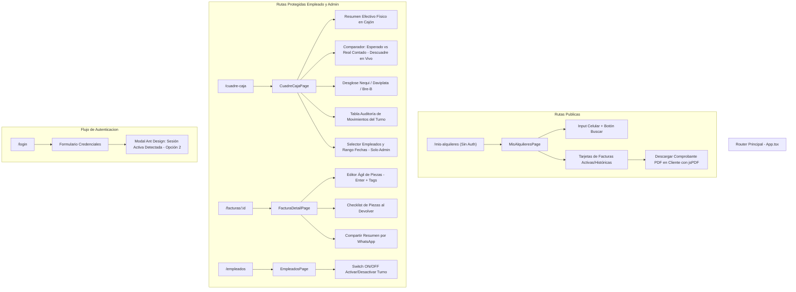

# ESPECIFICACIÓN DE ARQUITECTURA FRONTEND: SPRINT 1
## PROYECTO: CST BODEGÓN TRAJES — GESTIÓN Y ALQUILER DE TRAJES

**Rol:** `Bodegon-Frontend-Architect` (Arquitecto Frontend & Especialista en React)  
**Sprint:** Sprint 1 — Mejoras Operativas de Mostrador, Control de Dinero & Seguridad  
**Carpeta Oficial:** `.agents/governance/respuestas/sprint_1_mejoras/`  
**Rama de Trabajo:** `feature/sprint-1-mejoras`  
**Estado:** ✅ **APROBADO POR EL USUARIO HUMANO**  
**Fecha de Aprobación:** 2026-09-27  

---

## 1. Ficha Técnica Oficial del Stack Frontend

* **Framework & Bundler:** React 19 + TypeScript 5.7+ + Vite 8
* **Sistema de Diseño & UI:** Ant Design 6.x (`antd`, `@ant-design/icons`) + Tailwind CSS 4.x
* **Gestión de Estado Servidor & Caché:** TanStack Query 5.x (`@tanstack/react-query`)
* **Cliente HTTP:** Axios 1.x con interceptores de autorización e invalidación reactiva
* **Generación de Comprobantes PDF:** `jspdf` + `jspdf-autotable` (Generación client-side directa, zero almacenamiento en VPS)
* **Arquitectura de Código:** Clean Architecture Frontend (`domain/`, `application/`, `presentation/`)

---

## 2. Mapa de Rutas y Nuevos Módulos Frontend

---

## 3. Especificación Detallada por Componente Frontend

### 3.1. Generación de PDF al Vuelo en Cliente (`jspdf` + `jspdf-autotable`)
* **Ubicación:** `src/modules/factura/presentation/utils/factura-pdf.generator.ts`
* **Características:**
  - Generación 100% en memoria en el hilo del navegador.
  - Formato adaptable (comprobante formal carta o ticket térmico de 80 mm).
  - Incluye membrete oficial de CST Bodegón Trajes, número de factura, cliente, prendas con desglose de piezas, abono, método de pago, saldo pendiente, valor del depósito en custodia y fecha límite de devolución.
  - Zero almacenamiento en servidor: el archivo se descarga inmediatamente en el dispositivo del cliente.

### 3.2. Flujo de Sesión Única en UI (Opción 2)
* En `LoginPage`:
  - Manejo del código `HTTP 409 Conflict`: cuando la API responde `{ requiereConfirmacion: true }`, se despliega un `Modal` de Ant Design:
    - *Título:* **Sesión activa en otro dispositivo detectada**
    - *Contenido:* *"Tu cuenta ya tiene una sesión iniciada en otro equipo o navegador. Para ingresar aquí, debemos cerrar la sesión anterior para proteger tu cuenta."*
    - *Acciones:* `[ Cancelar ]` y `[ Sí, cerrar otra sesión e ingresar aquí ]`.
  - Al confirmar, reenvía la petición agregando `forzarCierre: true` en el payload de login.
* En `axios.ts`:
  - Si un empleado con sesión abierta en el Dispositivo A es invalidado por el Dispositivo B, la siguiente petición recibe `401 Unauthorized` por discrepancia de `sessionId`.
  - El interceptor dispara el modal reactivo informando el cierre de sesión y redirige de inmediato a `/login`.

### 3.3. Interacción de Desglose de Piezas en Mostrador
* En `factura-elementos-editor.tsx`:
  - Clic en el elemento o en el botón de edición de piezas abre el popover/modal de piezas.
  - Input con autofoco y listener `onKeyDown`:
    - Al presionar `Enter`, agrega la pieza instantáneamente al arreglo local.
    - Se renderiza como un `<Tag closable color="blue">` de Ant Design.
    - El empleado puede retirar piezas con un clic sobre la `x` del tag.
* En `devolucion-modal.tsx`:
  - Las piezas guardadas se presentan en un `Checkbox.Group`.
  - Indicador numérico dinámico: *"Recibidas X de Y piezas"*.
  - Si se desmarca una pieza, se muestra un campo de texto obligatorio para registrar la novedad y retener el valor correspondiente del depósito.

### 3.4. Módulo de Cuadre de Caja Diario (`/cuadre-caja`)
* **Componentes Principales:**
  1. `ArqueoHeroCard`: Muestra en grande el valor de **Efectivo Físico Esperado en Cajón** (Verde).
  2. `ComparadorCajaCard`: Campo numérico para ingresar el **Efectivo Real Contado**. Calcula en tiempo real:
     - Diferencia = Real Contado - Esperado.
     - Badge verde si `Diferencia === 0` ("¡Caja Cuadrada Perfecta!").
     - Badge rojo si `Diferencia < 0` ("Faltante en Caja").
     - Badge azul si `Diferencia > 0` ("Sobrante en Caja").
  3. `CanalesDigitalesCard`: Tarjetas de totales para **Nequi**, **Daviplata** y **Bre-B**.
  4. `TablaAuditoriaTurno`: Grilla con cada transacción registrada en el turno (Hora, Factura, Cliente, Concepto, Método, Monto).
  5. `FiltroTurnoBar`: Para administradores, permite seleccionar un empleado específico o consultar la caja consolidada con selector de rango de fechas.

### 3.5. Portal Público `/mis-alquileres`
* Ruta pública no protegida: `/mis-alquileres`.
* Componente `MisAlquileresPage`:
  - Formulario responsivo con input de celular validado (10 dígitos en Colombia).
  - Consulta al endpoint público `GET /api/v1/facturas/publica/cliente/:celular`.
  - Muestra tarjetas limpias con el estado de cada alquiler, saldo pendiente, piezas del traje y botón destacado `[ 📥 Descargar Comprobante PDF ]`.

### 3.6. Switch de Turnos en Empleados
* En `empleados-page.tsx`:
  - Columna "Turno / Acceso" con `<Switch checked={record.activo} loading={isPending} onChange={handleToggleActivo} />`.
  - Actualización optimista de interfaz mediante TanStack Query `invalidateQueries(['empleados'])`.
