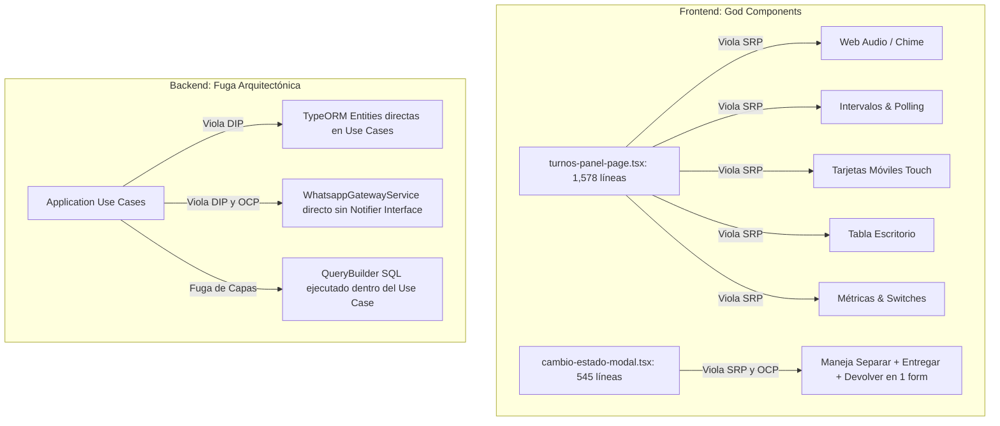
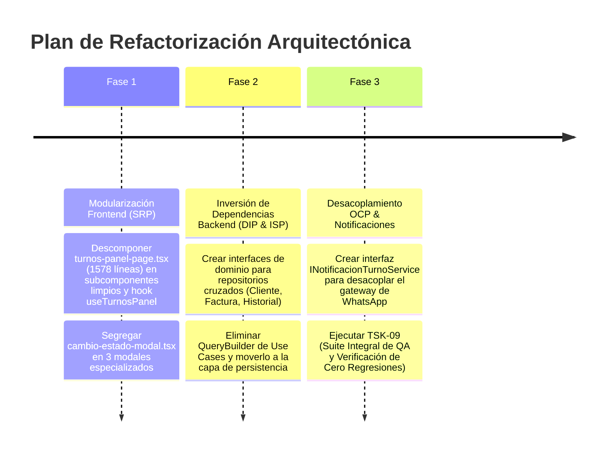

# INFORME DE AUDITORÍA DE CÓDIGO Y ARQUITECTURA: EVALUACIÓN DE PRINCIPIOS SOLID
## PROYECTO: CST BODEGÓN TRAJES — SPRINT 1 (MEJORAS OPERATIVAS Y DE MOSTRADOR)

* **Rol Técnico:** `Bodegon-Lead-Code-Auditor` (Auditor Líder de Calidad de Código, Principios SOLID & Deuda Técnica)  
* **Co-diseño Arquitectónico:** `Bodegon-Software-Architect` & `Bodegon-Frontend-Architect`  
* **Ámbito de Revisión:** Repositorio Completo (`backend/src` y `frontend/src`) — Tareas `[TSK-01]` a `[TSK-10]`  
* **Ubicación Oficial:** `.agents/governance/respuestas/sprint_1_mejoras/respuesta_auditor_calidad_codigo_solid.md`  
* **Rama de Trabajo:** `develop`  
* **Fecha de Emisión:** 29 de Septiembre de 2026  
* **Propósito:** Diagnosticar el grado de cumplimiento de los 5 principios SOLID, identificar componentes monolíticos ("God Components"), acoplamientos indebidos y proponer un plan de refactorización ordenado antes de la ejecución de `[TSK-09]` (Suite Integral de QA).

---

## 1. Resumen Ejecutivo y Diagnóstico Global

El proyecto **CST Bodegón Trajes** ha alcanzado una madurez funcional destacada en el Sprint 1: las invariantes financieras están protegidas con el Value Object `Dinero`, los turnos y el bot de WhatsApp operan de forma reactiva y los 80 tests unitarios pasan al 100%.

No obstante, tras someter el código a una inspección estricta bajo los estándares de **Clean Architecture y Principios SOLID**, se han identificado **focos significativos de deuda técnica y acoplamiento** que deben atenderse:

| Principio SOLID | Estado Actual | Calificación | Impacto en Mantenibilidad |
| :--- | :---: | :---: | :--- |
| **S** — *Single Responsibility Principle* (Responsabilidad Única) | ⚠️ **Violaciones Críticas** | **3.0 / 5.0** | **Alto:** Existen "God Components" en frontend (>1,500 líneas) y Use Cases que mezclan orquestación con consultas SQL complejas. |
| **O** — *Open/Closed Principle* (Abierto/Cerrado) | ⚠️ **Violaciones Moderadas** | **3.5 / 5.0** | **Medio:** Canales de mensajería (WhatsApp) y modales de transición acoplados rígidamente a tipos enumerados mediante cadenas `if/else`. |
| **L** — *Liskov Substitution Principle* (Sustitución de Liskov) | 🟡 **Violaciones Leves** | **4.0 / 5.0** | **Bajo:** Detección de comprobaciones defensivas en tiempo de ejecución (`typeof repo.find === 'function'`) por contratos de mocks parciales. |
| **I** — *Interface Segregation Principle* (Segregación de Interfaces) | ⚠️ **Violaciones Moderadas** | **3.2 / 5.0** | **Medio:** Use cases inyectan repositorios genéricos masivos de TypeORM con más de 30 métodos en lugar de interfaces mínimas requeridas. |
| **D** — *Dependency Inversion Principle* (Inversión de Dependencias) | ⚠️ **Violaciones Críticas** | **2.8 / 5.0** | **Alto:** Múltiples Casos de Uso del Backend dependen directamente de entidades de persistencia TypeORM en lugar de abstracciones de dominio. |

---

## 2. Radiografía Detallada de Hallazgos por Principio



---

### 2.1. Principio S: Single Responsibility Principle (SRP)
> *"Un módulo o clase debe tener una sola razón para cambiar."*

#### 🔴 Hallazgo S-01: God Component en Frontend — `turnos-panel-page.tsx` (1,578 líneas)
* **Archivo:** `frontend/src/modules/turnos/presentation/pages/turnos-panel-page.tsx`
* **Problema:** Este archivo acumula **demasiadas responsabilidades dispares**:
  1. Configuración de polling y listeners en tiempo real (`useEffect`, timers de 3.5s).
  2. Desbloqueo y reproducción de audio del navegador (`WebAudioHelper`).
  3. Filtrado y ordenamiento de 4 tipos de colas (`ALQUILAR`, `RECOGER`, `DEVOLVER`, `TODOS`).
  4. Renderizado completo de tarjetas móviles táctiles (`renderTurnoCard`).
  5. Definición y formateo de columnas para la tabla general de escritorio (`columnasGenerales`).
  6. Gestión de estado de modales secundarios (`FinalizarTurnoModal`).
  7. Formateo de fechas, cálculo de saldos y etiquetas de estado.
* **Impacto:** Cualquier cambio visual en las tarjetas de recogida o un ajuste en la lógica de polling obliga a modificar un archivo de más de 70 KB, elevando el riesgo de regresiones y conflictos de fusión (*merge conflicts*).
* **Solución Recomendada:** Extraer en subcomponentes modulares:
  - `components/TurnoCard.tsx` (o por tipo: `TurnoAlquilerCard`, `TurnoRecogidaCard`, `TurnoDevolucionCard`).
  - `components/TurnosResumenHeader.tsx` (métricas y tabs).
  - `components/TurnosGeneralTable.tsx` (tabla de escritorio).
  - `hooks/use-turnos-panel.ts` (custom hook que encapsule polling, audio y mutaciones).

---

#### 🔴 Hallazgo S-02: Modal Multifunción — `cambio-estado-modal.tsx` (545 líneas)
* **Archivo:** `frontend/src/modules/factura/presentation/components/cambio-estado-modal.tsx`
* **Problema:** En lugar de crear modales especializados, este componente único gestiona 3 operaciones de negocio completamente distintas:
  1. **Separación:** Abono inicial, descripción, fecha de recogida.
  2. **Entrega:** Cobro de saldo pendiente, recepción de depósito de garantía, métodos de pago.
  3. **Devolución:** Checklist de piezas por prenda, deducción de daños, reintegro de garantía.
* **Impacto:** El código está plagado de condicionales ternarios `accion === 'separar' ? ... : accion === 'entregar' ? ... : ...`. El estado del formulario se reinicia y valida de forma artificial para no cruzar campos.
* **Solución Recomendada:** Desacoplar en 3 modales independientes con responsabilidades claras:
  - `SepararFacturaModal.tsx`
  - `EntregarFacturaModal.tsx`
  - `DevolverFacturaModal.tsx`

---

#### 🟡 Hallazgo S-03: Use Case con Múltiples Responsabilidades — `listar-turnos-mostrador.use-case.ts` (201 líneas)
* **Archivo:** `backend/src/modules/turnos/application/use-cases/listar-turnos-mostrador.use-case.ts`
* **Problema:** El caso de uso realiza:
  1. Cálculo de métricas agregadas de resumen (esperas por cola).
  2. Consultas directas a base de datos mediante QueryBuilder SQL.
  3. Resolución y batch picking de facturas y elementos.
  4. Mapeo de strings y agregación de nombres de catálogo.
  5. Mapeo de respuesta de presentación.
* **Solución Recomendada:** Delegar la consulta agrupada de "Prendas de Bodega" a un método de repositorio o servicio de dominio (`IFacturaRepository.obtenerResumenPrendasPorFacturas(ids)`).

---

### 2.2. Principio O: Open/Closed Principle (OCP)
> *"Las entidades de software deben estar abiertas a la extensión, pero cerradas a la modificación."*

#### ⚠️ Hallazgo O-01: Acoplamiento Directo al Proveedor de Mensajería
* **Archivos:**
  - `backend/src/modules/turnos/application/use-cases/llamar-turno.use-case.ts`
  - `backend/src/modules/turnos/application/use-cases/verificar-gabela-turnos.use-case.ts`
  - `backend/src/modules/turnos/application/use-cases/solicitar-turno.use-case.ts`
* **Problema:** Los casos de uso inyectan directamente la clase concreta `WhatsappGatewayService`. Si el negocio decide agregar soporte para SMS (Twilio), notificaciones Push en navegador o mockear el canal en staging, hay que abrir y modificar todos los casos de uso.
* **Solución Recomendada:** Introducir una interfaz de dominio:
  ```typescript
  export interface INotificacionTurnoService {
    notificarLlamado(telefono: string, codigo: string, clienteNombre: string): Promise<void>;
    notificarTurnoAproximandose(telefono: string, codigo: string, clienteNombre: string): Promise<void>;
    notificarGabela(telefono: string, codigo: string, clienteNombre: string): Promise<void>;
  }
  ```
  `WhatsappGatewayService` implementará esta interfaz, permitiendo agregar nuevos proveedores sin alterar la lógica del caso de uso.

---

### 2.3. Principio L: Liskov Substitution Principle (LSP)
> *"Los subtipos deben ser sustituibles por sus tipos base sin alterar la correctitud del programa."*

#### 🟡 Hallazgo L-01: Descubrimiento de Capacidades en Tiempo de Ejecución
* **Archivo:** `backend/src/modules/turnos/application/use-cases/solicitar-turno.use-case.ts` (Línea 91)
* **Código:**
  ```typescript
  if (typeof this.clienteRepo.find === 'function') {
    const clientesMismoTelefono = await this.clienteRepo.find({ ... });
  }
  ```
* **Problema:** La presencia de `typeof repo.find === 'function'` dentro de un caso de uso es un síntoma de que el contrato inyectado no garantiza la disponibilidad de sus métodos, forzando al código de aplicación a verificar si el sustituto (mock de tests) realmente implementa la operación.
* **Solución Recomendada:** Definir la interfaz de repositorio `IClienteRepository` con los métodos explícitos requeridos (`buscarPorTelefono(celular: string)`). Tanto la implementación TypeORM como el Mock de pruebas implementarán el 100% del contrato sin necesidad de comprobaciones `typeof`.

---

### 2.4. Principio I: Interface Segregation Principle (ISP)
> *"Los clientes no deben verse obligados a depender de interfaces que no utilizan."*

#### ⚠️ Hallazgo I-01: Dependencia de Repositorios Genéricos "Gordos"
* **Archivos:**
  - `backend/src/modules/turnos/application/use-cases/solicitar-turno.use-case.ts`
  - `backend/src/modules/caja/application/use-cases/obtener-cuadre-caja-empleado.use-case.ts`
* **Problema:** Se inyecta `Repository<ClienteTypeOrmEntity>` y `Repository<FacturaTypeOrmEntity>` de TypeORM. Estas interfaces exponen métodos como `query()`, `clear()`, `softDelete()`, `restore()`, etc., que un caso de uso de consulta jamás debería tener a su disposición.
* **Impacto:** En pruebas unitarias, se deben simular estructuras complejas internas de TypeORM en lugar de mockear una función limpia de un solo propósito.
* **Solución Recomendada:** Segregar en interfaces específicas por necesidad operativa:
  - `IClienteLookupRepository` (solo `buscarPorTelefono`, `crearProspecto`).
  - `IFacturaTurnoRepository` (solo `buscarFacturaParaTurno`).

---

### 2.5. Principio D: Dependency Inversion Principle (DIP)
> *"Los módulos de alto nivel no deben depender de módulos de bajo nivel. Ambos deben depender de abstracciones."*

#### 🔴 Hallazgo D-01: Inyección Directa de Entidades TypeORM en Capa de Aplicación
* **Archivos:**
  - `solicitar-turno.use-case.ts`:
    ```typescript
    @InjectRepository(ClienteTypeOrmEntity) private readonly clienteRepo: Repository<ClienteTypeOrmEntity>,
    @InjectRepository(FacturaTypeOrmEntity) private readonly facturaRepo: Repository<FacturaTypeOrmEntity>,
    ```
  - `listar-turnos-mostrador.use-case.ts`:
    ```typescript
    @InjectRepository(FacturaTypeOrmEntity) private readonly facturaRepo: Repository<FacturaTypeOrmEntity>,
    @InjectRepository(FacturaElementoTypeOrmEntity) private readonly elementoRepo: Repository<FacturaElementoTypeOrmEntity>,
    @InjectRepository(ElementoCatalogoTypeOrmEntity) private readonly catalogoRepo: Repository<ElementoCatalogoTypeOrmEntity>,
    ```
  - `obtener-cuadre-caja-empleado.use-case.ts`:
    ```typescript
    @InjectRepository(HistorialFacturaTypeOrmEntity) private readonly historialRepo: Repository<HistorialFacturaTypeOrmEntity>,
    @InjectRepository(FacturaTypeOrmEntity) private readonly facturaRepo: Repository<FacturaTypeOrmEntity>,
    @InjectRepository(ClienteTypeOrmEntity) private readonly clienteRepo: Repository<ClienteTypeOrmEntity>,
    @InjectRepository(EmpleadoTypeOrmEntity) private readonly empleadoRepo: Repository<EmpleadoTypeOrmEntity>,
    ```
* **Problema:** Mientras que para `Turno` sí se creó correctamente `ITurnoRepository` con `@Inject(TURNO_REPOSITORY)`, para las entidades de otros módulos (`Factura`, `Cliente`, `Historial`, `Empleado`) los casos de uso dependen directamente de la tecnología TypeORM y de sus entidades de persistencia (`*TypeOrmEntity`).
* **Fuga Arquitectónica:** Si mañana se migra la persistencia de Facturas a otro motor o a Prisma, estos Casos de Uso de Aplicación se romperían de inmediato.
* **Solución Recomendada:** Crear abstracciones de dominio (Domain Repositories) con Symbols en NestJS (`@Inject(CLIENTE_REPOSITORY)`, `@Inject(FACTURA_REPOSITORY)`), invirtiendo formalmente la dependencia.

---

## 3. Plan de Refactorización Estructurado (Roadmap Técnico)

Para no introducir riesgos innecesarios antes de `[TSK-09]`, proponemos dividir la refactorización en **3 Fases Priorizadas**:



### 📋 Detalle de Tareas de Refactorización

#### 🟢 Fase 1: Modularización Frontend (Máximo Retorno, Cero Riesgo en BD)
1. **`REF-FE-01` Descomposición de `turnos-panel-page.tsx`:**
   - Extraer `TurnoCard.tsx` (tarjeta móvil táctil con sus badges y acciones).
   - Extraer `TurnosGeneralTable.tsx` (tabla de escritorio con columnas y acciones).
   - Extraer `TurnosResumenHeader.tsx` (contadores en espera y botones de filtro).
   - Extraer custom hook `useTurnosPanel.ts` (polling, mutaciones de llamada/atención/finalización, chime).
   - **Resultado:** Reducción de `turnos-panel-page.tsx` de 1,578 a ~250 líneas declarativas y limpias.
2. **`REF-FE-02` Segregación de `cambio-estado-modal.tsx`:**
   - Crear `SepararFacturaModal.tsx`, `EntregarFacturaModal.tsx`, `DevolverFacturaModal.tsx`.
   - **Resultado:** Eliminación total de condicionales anidados y reducción del riesgo de mezclar estados de cobro.

#### 🟡 Fase 2: Inversión de Dependencias en Backend (DIP / Clean Architecture)
1. **`REF-BE-01` Repositorios de Dominio Desacoplados:**
   - Crear `IClienteRepository` y `IFacturaRepository` en la capa de dominio de turnos/caja.
   - Reemplazar `@InjectRepository(TypeOrmEntity)` por `@Inject(SYMBOL)` en `SolicitarTurnoUseCase`, `ListarTurnosMostradorUseCase`, `FinalizarTurnoUseCase` y `ObtenerCuadreCajaEmpleadoUseCase`.
2. **`REF-BE-02` Encapsulación de Consultas SQL:**
   - Mover el `.createQueryBuilder(...)` de `ListarTurnosMostradorUseCase` al repositorio de persistencia `FacturaTypeOrmRepository`.

#### 🔵 Fase 3: Desacoplamiento de Notificaciones y Ejecución de `[TSK-09]`
1. **`REF-BE-03` Abstracción de Notificaciones (OCP):**
   - Interfaz `INotificacionService` implementada por `WhatsappGatewayService`.
2. **Ejecución de `[TSK-09]`:**
   - Correr la suite de 80+ tests unitarios, verificar cero regresiones, compilar producción en frontend/backend y emitir el reporte final de Gate 1.

---

## 4. Recomendación del Auditor y Consulta al Humano

> **Veredicto Técnico:**  
> Es **altamente recomendable** ejecutar al menos la **Fase 1 (Modularización Frontend de `turnos-panel-page.tsx` y `cambio-estado-modal.tsx`)** y el desacoplamiento básico de DIP en Backend antes de ejecutar formalmente la tarea `[TSK-09]`.  
>  
> Realizar estos ajustes ahora nos permitirá que la suite de pruebas unitarias y compilación de producción de `[TSK-09]` audite y certifique un código con **alta cohesión, bajo acoplamiento y estructura limpia**, evitando arrastrar deuda técnica a los siguientes sprints.

---

### Pregunta de Decisión para el Usuario:
¿Deseas que procedamos a ejecutar la **Fase 1 de refactorización** (descomponer `turnos-panel-page.tsx` y separar los modales de estado en frontend) antes de pasar a la tarea de pruebas `[TSK-09]`, o prefieres que abordemos también el desacoplamiento de repositorios DIP en backend en una sola tanda?
