# ESPECIFICACIÓN DE SEGURIDAD, QA & HARDENING: SPRINT 1
## PROYECTO: CST BODEGÓN TRAJES — GESTIÓN Y ALQUILER DE TRAJES

**Rol:** `Bodegon-QA-Security-Auditor` (Auditor de Seguridad de Software & QA Lead)  
**Sprint:** Sprint 1 — Mejoras Operativas de Mostrador, Control de Dinero & Seguridad  
**Carpeta Oficial:** `.agents/governance/respuestas/sprint_1_mejoras/`  
**Rama de Trabajo:** `feature/sprint-1-mejoras`  
**Estado:** ✅ **APROBADO POR EL USUARIO HUMANO**  
**Fecha de Aprobación:** 2026-09-28  

---

## 1. Mapa de Vectores de Seguridad y Mitigaciones

```mermaid
graph TD
    subgraph Vector 1: Portal Publico por Celular
        AtaqueEnum[Bot intenta enumerar celulares secuenciales] --> RateLimit[Throttling: Max 10 peticiones/min por IP]
        RateLimit --> RegexVal[Validación estricta regex: Celular Colombia 10 dígitos]
        RegexVal --> SanitizedDTO[DTO Público Sanitizado: Cero datos sensibles o notas de empleados]
    end

    subgraph Vector 2: Concurrencia de Sesion y Turnos
        DispositivoViejo[Dispositivo A intenta operar con token previo] --> JwtGuard[JwtStrategy: Compara sessionId con BD]
        JwtGuard --> MismatchUUID[Discrepancia detectada: HTTP 401 Unauthorized Inmediato]
        SwitchOff[Admin desactiva switch de empleado] --> BlockRequest[HTTP 401: Usuario desactivado bloqueado al instante]
    end

    subgraph Vector 3: Integridad Financiera
        MovimientosCaja[Abonos, Saldos, Depósitos, Reintegros] --> DineroVO[Value Object Dinero Inmutable]
        DineroVO --> CuadreCajaMath[Fórmula exacta sin decimales flotantes: Cero descuadres]
    end
```

---

## 2. Estrategia de Blindaje y Hardening para Sprint 1

### 2.1. Blindaje del Portal Público (`GET /api/v1/facturas/publica/cliente/:celular`)
* **Throttling / Rate Limiting Aprobado por el Humano:**
  - Configurado a un máximo de **10 consultas por minuto por dirección IP**. Esto permite que familias o clientes consulten con comodidad sin ser bloqueados indebidamente, al tiempo que neutraliza ataques automatizados de scraping o fuerza bruta.
* **Validación de Formato de Celular:**
  - Expresión regular estricta para números de telefonía móvil en Colombia: `^3[0-9]{9}$` (10 dígitos obligatorios comenzando en 3). Peticiones inválidas son rechazadas con HTTP 400 antes de ejecutar consultas en base de datos.
* **Minimización Estricta de Datos (Zero Sensitive Leaks):**
  - El DTO público únicamente expone: número de factura, fechas de entrega/devolución, estado, prendas y piezas, valor total, abono y saldo pendiente.
  - **Exclusión total garantizada:** Documentos de identidad (cédulas), nombres/IDs de empleados, notas internas de mostrador y hashes del sistema.

### 2.2. Blindaje de Sesión Única y Control de Turnos
* **Invalidación Atómica de Sesiones Previas (Opción 2):**
  - Generación de `UUID v4` criptográfico para cada nuevo `session_id`.
  - El `JwtStrategy` valida en cada petición protegida que el `sessionId` del token coincida exactamente con el de la base de datos. Si no coincide, retorna `401 Unauthorized` de inmediato.
* **Control de Turno Inmediato (Switch ON/OFF):**
  - Si el administrador desactiva a un empleado (`activo = false`), el interceptor y guardián JWT bloquean cualquier petición posterior, revocando el acceso en tiempo real.

### 2.3. Integridad Financiera en Cuadre de Caja
* **Operaciones Inmutables con Value Object `Dinero`:**
  - Todas las sumas y restas de arqueo de caja (Efectivo físico, Nequi, Daviplata, Bre-B) se calculan mediante el VO `Dinero`, evitando imprecisiones de coma flotante.

---

## 3. Matriz de Pruebas Unitarias del Sprint 1 (`[TSK-09]`)

| Suite de Pruebas | Caso de Prueba Unitario | Comportamiento Esperado |
| :--- | :--- | :--- |
| `login.use-case.spec.ts` | Intento de login con sesión previa activa (`forzarCierre = false`) | Debe responder HTTP 409 con `requiereConfirmacion: true`. |
| `login.use-case.spec.ts` | Confirmación de toma de sesión (`forzarCierre = true`) | Debe generar un nuevo `sessionId`, actualizar BD y emitir JWT válido. |
| `jwt.strategy.spec.ts` | Petición con `sessionId` desactualizado o empleado `activo = false` | Debe lanzar `UnauthorizedException` inmediatamente. |
| `cuadre-caja.use-case.spec.ts` | Simulación de día con múltiples pagos (Efectivo, Nequi, Bre-B) | Debe calcular exactamente: Entradas - Salidas = Físico en cajón y desglose digital. |
| `agregar-elemento.use-case.spec.ts` | Adición de elemento inexistente en catálogo | Debe auto-insertarlo en `elementos_catalogo` con su precio sugerido. |
| `devolver-prendas.use-case.spec.ts` | Verificación del array `piezas jsonb` en devolución | Debe persistir las piezas devueltas y registrar observaciones si falta alguna. |
