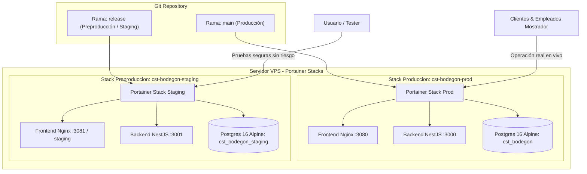

# ESPECIFICACIÓN DE INFRAESTRUCTURA & DEVOPS: SPRINT 1
## PROYECTO: CST BODEGÓN TRAJES — GESTIÓN Y ALQUILER DE TRAJES

**Rol:** `Bodegon-DevOps-Engineer` (Ingeniero de Infraestructura & Despliegue en VPS)  
**Sprint:** Sprint 1 — Mejoras Operativas de Mostrador, Control de Dinero & Seguridad  
**Carpeta Oficial:** `.agents/governance/respuestas/sprint_1_mejoras/`  
**Rama de Trabajo:** `feature/sprint-1-mejoras`  
**Estado:** ✅ **APROBADO POR EL USUARIO HUMANO**  
**Fecha de Aprobación:** 2026-09-28  

---

## 1. Topología de Doble Ambiente (Staging & Producción en Portainer)

Atendiendo la directriz del Humano, la infraestructura en el VPS se desacopla formalmente en **dos ambientes independientes** gestionados a través de **Portainer / Docker Compose**:

### 1.1. Especificación de Ambientes

1. **Ambiente de Preproducción (Staging):**
   * **Rama Asociada:** `release` (rama permanente del Git Flow).
   * **Objetivo:** Permitir al usuario realizar pruebas operativas de mostrador (simular pagos, arqueos, PDFs, bloqueo de sesión) en un entorno 100% idéntico a producción pero completamente aislado.
   * **Base de Datos:** `cst_bodegon_staging` (datos de prueba que no contaminan los registros contables reales).
   * **Aislamiento:** Si una prueba falla o se requiere reiniciar contenedores, la tienda física y los empleados en mostrador no sufren ninguna interrupción.

2. **Ambiente de Producción:**
   * **Rama Asociada:** `main`.
   * **Objetivo:** Sistema en vivo utilizado por empleados para facturar, entregar prendas y cobrar.
   * **Criterio de Promoción:** Solo recibe código que haya superado exitosamente el **Gate de Validación Humana** en la rama `release` de preproducción.

---

## 2. Plan de Auditoría y Hardening de Portainer (Fase Pre-Producción)

Antes de promover el Sprint 1 a producción, el Ingeniero DevOps ejecutará una **auditoría completa de la configuración en Portainer**:

* **Verificación de Stacks y Docker Compose:**
  - Validación de políticas de reinicio automático (`restart: unless-stopped`).
  - Asignación de límites de recursos de memoria RAM y CPU para prevenir que un contenedor agote el servidor VPS.
  - Verificación de que las redes de Docker sean internas tipo `bridge` cerradas y que los puertos de PostgreSQL (`5432`) **no** estén expuestos a la IP pública del VPS.
* **Gestión Segura de Secretos y Variables de Entorno:**
  - Confirmar que los `.env` de Staging y Producción estén cargados de manera segura en Portainer y nunca versionados en Git.
  - Separación de `JWT_SECRET`, contraseñas de BD y puertos entre ambos ambientes.
* **Mapeo de Volúmenes y Backups:**
  - Verificación de los volúmenes persistentes (`pgdata_prod` y `pgdata_staging`).
  - Script automatizado de respaldo diario `pg_dump` con retención local/remota.

---

## 3. Directivas Nginx y Política Zero-Storage

* **Enrutamiento SPA en Nginx (`frontend/nginx.conf`):**
  - Se mantiene la directiva `try_files $uri $uri/ /index.html;` tanto en Staging como en Producción.
  - Esto garantiza que las rutas profundas (`/mis-alquileres`, `/cuadre-caja`) carguen con fluidez al entrar directamente desde enlaces compartidos por WhatsApp en celulares.
* **Zero PDF Storage en Servidor:**
  - Validación técnica aprobada: la generación de PDF con `jspdf` se ejecuta en la memoria RAM del navegador del cliente. El VPS tiene **cero consumo de disco** por facturas, eliminando cuellos de botella de I/O y saturación de almacenamiento.
