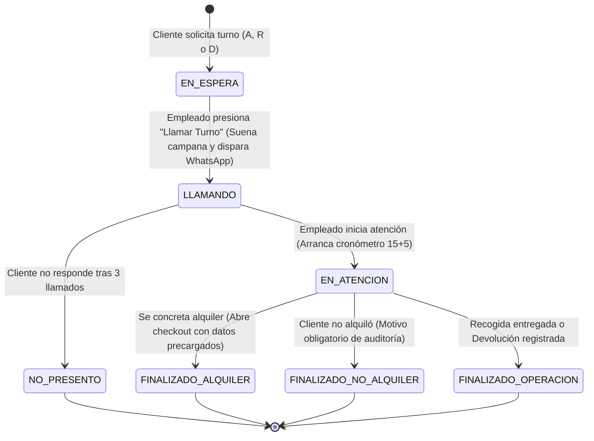

# SPEC TÉCNICA / HISTORIA DE USUARIO: TSK-10
## PROYECTO: CST BODEGÓN TRAJES — SPRINT 1 (MEJORAS DE MOSTRADOR)
**ID de Tarea:** `[TSK-10]`  
**Título:** Gestor Inteligente de Turnos en Mostrador (Alquiler, Recogida en Lote, Devolución, Cronómetro 15+5 con Alerta Sonora/WhatsApp y Auditoría de Cierre)  
**Agente Responsable:** `Bodegon-Spec-Engineer` (en co-diseño con `Bodegon-Software-Architect`, `Bodegon-QA-Security-Auditor`, `Bodegon-Database-Engineer` y `Bodegon-UIUX-Designer`)  
**Estado:** 🟢 **100% BLINDADA CON DECISIONES DE NEGOCIO Y OPERACIONES VALIDADAS**  

---

### 1. Contexto, Necesidad y Alcance (Context & Boundary)

* **Problema de Negocio Detectado:**
  1. En días y horas pico de CST Bodegón Trajes (especialmente fines de semana y temporadas de eventos/graduaciones), los clientes se aglomeran en el mostrador sin un orden predecible, generando fricciones en la fila y tiempos de espera desmedidos.
  2. Los clientes que prueban trajes a veces extienden indebidamente el tiempo en los probadores, colapsando la atención para quienes esperan.
  3. Los empleados deben preguntar repetidamente nombres y teléfonos para iniciar un alquiler, ralentizando el registro en caja.
  4. Quienes van a **recoger trajes ya reservados** sufren demoras porque el empleado va a bodega de forma individual por cada paquete, caminando múltiples veces de ida y vuelta en lugar de realizar una búsqueda agrupada por lote (*Batch Picking*).
  5. Los empleados a veces deben salir a llamar clientes a viva voz a la calle o al pasillo exterior.

* **Objetivo de la Solución:**
  1. Proveer un **Portal Público de Solicitud de Turno Móvil (`/turnos`)** al que los clientes ingresan mediante código QR exhibido en la entrada del local o enlace web.
  2. Ofrecer **3 opciones claras con prefijos explícitos y significado visible**:
     - 👗 **`ALQUILER` (Prefijo `A-XX`):** Asesoría de estilo y probador de trajes.
     - 📦 **`RECOGIDA` (Prefijo `R-XX`):** Retiro de prendas previamente reservadas.
     - 🔄 **`DEVOLUCIÓN` (Prefijo `D-XX`):** Recepción y revisión de prendas prestadas.
  3. **Reinicio Diario de Turnos:** Cada medianoche (00:00 UTC-5), los contadores diarios se reinician a 1 (`A-01`, `R-01`, `D-01`).
  4. **Pre-registro Ágil de Clientes:**
     - El cliente ingresa su celular (10 dígitos).
     - Si ya está registrado en la base de datos, el sistema rescata automáticamente su nombre.
     - Si es un cliente nuevo, pide nombres y apellidos en una sola casilla y crea el prospecto en BD (`documento: null`).
     - Al formalizar el alquiler en caja, el empleado solo solicita la cédula y no tiene que volver a teclear el nombre ni el teléfono.
  5. **Vinculación Automática con Factura Reservada en Recogida:**
     - Si el cliente elige `RECOGIDA`, el backend busca facturas activas en estado `SEPARADO` de ese celular y enlaza el turno.
  6. **Panel Interno de Mostrador con 4 Pestañas Operativas (`/turnos-panel`):**
     - 📋 **Todos los turnos:** Cola general cronológica.
     - 👗 **Cola para alquilar (`A`):** Asignación a probadores con cronómetro.
     - 📦 **Cola para recoger (`R`):** Vista de **Alistamiento en Bodega** que lista los nombres y prendas de las próximas entregas para que el personal busque los 5 o 6 paquetes de una sola ida a bodega.
     - 🔄 **Cola para devolver (`D`):** Recepción y liquidación rápida.
  7. **Contador Regresivo de Espera en Vivo por Tipo de Fila (`/turno/:id`):**
     - Conteo independiente por cola (`A` con `A`, `R` con `R`, `D` con `D`).
     - Alerta visual progresiva en la pantalla móvil del cliente:
       - 4 o más personas antes: `Hay {N} personas antes de ti en la cola de {tipo}` (Azul).
       - Faltan 3 personas: `⏳ Faltan 3 personas para tu turno` (Amarillo).
       - Faltan 2 personas: `⚠️ ¡Prepárate! Solo faltan 2 personas antes de ti. Por favor acércate a la entrada de la tienda` (Naranja preventivo).
       - Falta 1 persona: `⚡ ¡Eres el siguiente turno! Muy atento a la pantalla` (Ámbar prioritario).
  8. **WhatsApp Preventivo Único (Cuando faltan 2 personas):**
     - Disparado automáticamente por el Bot Gateway (`TSK-08B`) al pasar a tener 2 personas por delante:
       *«¡Hola {Nombre}! Tu turno de {tipo} #{codigo} en CST Bodegón Trajes se aproxima ⏳. Solo faltan 2 personas antes de ti. Por favor acércate a la entrada de la tienda para no perder tu lugar.»*
     - Se registra `alerta_previa_enviada = true` en BD para evitar duplicidad de mensajes.
  9. **Doble Mecanismo de Llamado Definitivo (Sonido en Navegador + WhatsApp Bot):**
     - Pantalla interactiva del cliente (`/turno/:id`) con botón `[ 🔔 Activar timbre ]` (AudioContext / Web Audio API) que suena tipo chime al ser llamado.
     - Notificación instantánea vía WhatsApp mediante el Bot Gateway (`TSK-08B`) informando que se acerque de inmediato al mostrador.
  10. **Cronómetro de Probador (15 min + 5 min de Gabela):**
      - Contador regresivo de 15 minutos visible tanto en la pantalla del empleado como en el celular del cliente.
      - Al llegar al minuto 15:00, entra a la gabela de 5 minutos (color amarillo) y dispara un mensaje amable de empatía colectiva tanto en pantalla como por WhatsApp.
      - Al llegar a 20:00, cambia a color rojo de tiempo excedido.
  11. **Auditoría de Cierre de Turno:**
      - Opciones: `FINALIZADO_ALQUILER`, `FINALIZADO_NO_ALQUILER` (con motivo obligatorio: *Talla/ajuste, Color/estilo, Precio, Solo cotización, Otro*) o `NO_PRESENTO`.

---

### 2. Perspectiva Multidisciplinaria del Squad (Decisiones por Rol)

#### 👔 Visión del Product Owner & Business Analyst (`Bodegon-Product-Owner`)
1. **Erradicación de Fila en Puerta & Experiencia del Cliente:**
   - En horas pico, la aglomeración física en la entrada genera fricción entre clientes y proyecta desorden. El portal móvil `/turnos` permite al cliente esperar cómodamente donde desee en los alrededores de la tienda.
2. **Contador Regresivo & WhatsApp Preventivo (Entrada de la Tienda):**
   - El cliente que ve en su celular cómo avanza la fila (*"Faltan 3"*, *"Faltan 2"*, *"Falta 1"*) experimenta certidumbre y control.
   - El WhatsApp preventivo automático cuando faltan exactamente 2 personas (*"Por favor acércate a la entrada de la tienda para no perder tu lugar"*) le da el margen perfecto de 3 a 5 minutos para acercarse con calma sin hacer esperar al mostrador.
3. **Pre-registro Sin Fricción:**
   - Para no desmotivar al cliente en el QR de la puerta, únicamente se le pide celular y nombre en una sola casilla. La cédula/documento se solicita únicamente al formalizar el contrato de alquiler en caja.
4. **Batch Picking (Alistamiento en Lote para Bodega):**
   - El personal de bodega ahorra hasta un 70% de tiempo al buscar 4 o 5 trajes de una sola ida a bodega, teniéndolos listos en mostrador antes de llamar al cliente.

#### 🏗️ Visión del Software Architect (`Bodegon-Software-Architect`)
1. **Modularidad y Clean Architecture en NestJS:**
   - Módulo independiente `backend/src/modules/turnos/` con capas limpias: Dominio (`Turno`, `TipoTurno`, `EstadoTurno`), Aplicación (Casos de Uso), Infraestructura (TypeORM) y Presentación (Controlador REST).
2. **Generación Secuencial Atómica con Reinicio Diario:**
   - Secuencias independientes por tipo (`A-01`, `R-01`, `D-01`).
   - Bloqueo transaccional o cálculo `MAX(numero_diario) + 1` filtrado por `(fecha_turno, tipo)` para garantizar números correlativos sin saltos ni colisiones si varios clientes escanean el QR a la vez.
3. **Recálculo Reactivo de la Fila & Despacho Asíncrono de WhatsApp:**
   - Al cambiar el estado de un turno (`LLAMANDO` o `EN_ATENCION`), se dispara de forma desacoplada el recálculo de la posición de los turnos en espera para ese tipo de cola.
   - Si el turno en la posición 2 no ha recibido su aviso (`alerta_previa_enviada == false`), se llama a `WhatsappGatewayService.sendTextMessage()` en segundo plano sin ralentizar la respuesta HTTP al mostrador.
4. **Integración con Facturas y Clientes:**
   - Inyección de repositorios de `Factura` (para asociar facturas en estado `SEPARADO` en recogidas) y `Cliente` (para autocompletar o crear el prospecto con `documento: null`).

#### 🗄️ Visión del Database Engineer (`Bodegon-Database-Engineer`)
1. **Esquema de Datos Atómico e Índices de Alto Rendimiento:**
   - Tabla `turnos` con tipos enumerados de PostgreSQL (`tipo_turno_enum`, `estado_turno_enum`).
   - Índices estratégicos:
     - `idx_turnos_fecha_estado (fecha_turno, estado)`: Respuesta sub-milisegundo para el panel de mostrador.
     - `idx_turnos_tipo (tipo)`: Filtro instantáneo por cola (`A`, `R`, `D`).
     - `idx_turnos_codigo_diario UNIQUE (fecha_turno, codigo)`: Garantía estricta a nivel de motor de BD de que no existirá un `A-01` duplicado en el mismo día.
2. **Idempotencia de Notificaciones:**
   - Flags booleanos `alerta_gabela_enviada` y `alerta_previa_enviada` garantizan que ningún cliente reciba mensajes duplicados bajo ninguna circunstancia de red o reintento.
3. **Integridad de Clientes:**
   - Confirmado que la columna `documento` en la tabla `clientes` ya admite valores nulos, permitiendo la creación limpia de prospectos desde el formulario de turnos sin violar restricciones de unicidad.

#### 🎨 Visión del Diseñador UI/UX & Responsive (`Bodegon-UIUX-Designer`)
1. **Pantalla Pública Móvil del Cliente (`/turnos` y `/turno/:id`):**
   - Enfoque Mobile-First optimizado para cualquier pantalla de smartphone.
   - Selector visual de trámite con tarjetas grandes, íconos y significado explícito (👗 Alquiler, 📦 Recogida, 🔄 Devolución).
   - **Contador Progresivo Semafórico de Alta Visibilidad:**
     - 4+ personas antes: Badge informativo azul.
     - 3 personas antes: Badge de atención amarillo.
     - 2 personas antes: Badge naranja preventivo con animación suave indicando acercarse a la entrada de la tienda.
     - 1 persona antes: Badge ámbar prioritario («¡Eres el siguiente turno!»).
     - Llamado: Pantalla verde vibrante con efecto pulsante y vibración háptica.
2. **Alerta Sonora Web Audio API:**
   - Botón táctil `[ 🔔 Activar timbre ]` que inicializa el `AudioContext` tras interacción del usuario (cumpliendo las políticas de autoplay de iOS Safari y Chrome Android).
   - Generación sintética de un acorde melodioso (*chime* tipo mostrador de 523Hz + 659Hz) sin depender de archivos de audio externos pesados.
3. **Panel de Mostrador de 4 Pestañas (`/turnos-panel`):**
   - Interfaz de escritorio/tablet para empleados con pestañas segmentadas, cronómetro circular para probadores con cambio de color verde (0-15m) -> amarillo (15-20m) -> rojo (>20m) y tarjetas de recogida para bodega con checklist táctil.

#### 🛡️ Visión del Auditor QA & Seguridad (`Bodegon-QA-Security-Auditor`)
1. **Seguridad en Endpoints Públicos y Privados (RBAC):**
   - Endpoints públicos (`/api/v1/turnos/solicitar`, `/api/v1/turnos/:id/vivo`): Libres de JWT pero protegidos contra bots mediante rate-limiting por IP (máximo 5 turnos por minuto por IP).
   - Endpoints de mostrador (`/api/v1/turnos/mostrador`, `llamar`, `iniciar-atencion`, `finalizar`): Protegidos con `JwtAuthGuard` y `RolesGuard(['empleado', 'admin', 'propietario'])`.
2. **Degradación Elegante (Fallback Operativo):**
   - Si el bot de WhatsApp estuviese desconectado temporalmente, los métodos de turnos continúan funcionando al 100% en mostrador y en pantalla web, registrando un log de advertencia sin lanzar error 500 al empleado.
3. **Auditoría de Cierre Obligatoria:**
   - La máquina de estados impide cerrar un turno como `FINALIZADO_NO_ALQUILER` sin registrar el motivo (talla, color, precio, cotización), asegurando datos fidedignos de pérdida comercial.

#### ⚙️ Visión del Ingeniero DevOps & Infraestructura (`Bodegon-Devops-Engineer`)
1. **Sin Dependencias de Infraestructura Adicional:**
   - Toda la gestión de turnos se resuelve en PostgreSQL y NestJS en memoria, sin requerir Redis, RabbitMQ ni microservicios externos, manteniendo el consumo de la VPS en mínimos.
2. **Enrutamiento Nginx SPA:**
   - Las nuevas rutas de frontend (`/turnos`, `/turno/:id`, `/turnos-panel`) están contempladas bajo el `try_files` existente en la configuración de Nginx.
3. **Sincronización Horaria Estricta:**
   - Toda la lógica de "Turnos de Hoy" y el reinicio a medianoche se calcula utilizando la zona horaria del negocio `America/Bogota` (UTC-5), evitando desfases provocados por la hora UTC del servidor.

---

### 3. Definición Funcional y Reglas de Negocio Validadas

* **Narrativa de Usuario (Cliente):**
  > **Como** cliente que llega a CST Bodegón Trajes,  
  > **Quiero** escanear el QR de la entrada, elegir si vengo a alquilar, recoger o devolver y poner mi celular,  
  > **Para** saber en qué turno voy, esperar cómodamente sin hacer fila de pie y escuchar una alerta sonora y recibir un WhatsApp cuando sea mi momento de pasar.

* **Narrativa de Usuario (Empleado de Bodega / Mostrador):**
  > **Como** empleado de bodega de CST Bodegón Trajes,  
  > **Quiero** ver en la pestaña "Cola para recoger" los próximos 5 paquetes que vienen a retirar,  
  > **Para** buscarlos todos juntos en la bodega en una sola ida y tenerlos listos en el mostrador antes de llamar a cada persona.

* **Reglas Deterministas de la Máquina de Estados:**



* **Reglas de Cronómetro y Alertas (15 + 5 Minutos):**
  1. `Minuto 00:00 a 15:00`: Barra en **Verde**. Atención estándar en probador.
  2. `Minuto 15:00 exacto`:
     - El cronómetro cambia a **Amarillo/Naranja**.
     - La pantalla del cliente muestra el modal/banner empático:
       > *"¡Hola! Has alcanzado los 15 minutos de asesoría en probador.Te quedan unos minutos adicionales para definir tu elección. Pensemos en todos: si la tienda cuenta con alto aforo, te agradecemos agilizar tu decisión para dar paso al siguiente turno."*
     - El Bot de WhatsApp (`TSK-08B`) envía este mismo texto al WhatsApp del cliente de forma automática.
  3. `Minuto 20:01 en adelante`:
     - El cronómetro cambia a **Rojo parpadeante**.
     - Indica al empleado: *"Tiempo límite de gabela superado (20 min)"*.

* **Reglas de Pre-registro de Cliente y Cédula:**
  - Si el celular ingresado coincide con un cliente existente en la tabla `clientes`, el turno se asocia a su `cliente_id` y muestra: *"Bienvenido de nuevo, {nombre}"*.
  - Si no existe:
    - Se solicita en un solo campo: `Nombre y Apellido` (ej. `"Manuel Esteban Baez"`).
    - Se inserta en la tabla `clientes` con `documento = NULL` y `telefono = :celular`.
  - Cuando el turno es atendido y se presiona `[ Crear Factura / Alquilar ]`:
    - El formulario de factura abre con el cliente ya seleccionado.
    - El sistema exige completar el número de documento/cédula (requerido para el contrato y el PIN de autoconsulta de `TSK-07`).

* **Reglas de las 4 Pestañas de Mostrador (`/turnos-panel`):**
  1. **Todos los turnos:** Lista ordenada por hora de llegada (`created_at ASC`) filtrando turnos de hoy que estén en `EN_ESPERA` o `LLAMANDO`.
  2. **Cola para alquilar (`A`):** Lista únicamente turnos con prefijo `A`. Muestra botones: `[ 📢 Llamar ]`, `[ Iniciar ]`, `[ Finalizar ]`.
  3. **Cola para recoger (`R`):** Muestra el listado de personas esperando retiro junto con el **resumen de la prenda a entregar**:
     - Si hay factura asociada: Muestra `#FACT-XXXX`, prendas (ej. *"Smoking Negro T38"*) y saldo pendiente por cobrar.
     - Permite al encargado de bodega alistar los paquetes en bloque.
  4. **Cola para devolver (`D`):** Lista personas que traen prendas. Botón directo `[ Registrar Devolución ]` que abre el modal de checklist de piezas (`TSK-05`).

---

### 4. Modelo de Datos y Esquema de Base de Datos

#### Migración: `CreateTurnosTable.ts`

```sql
CREATE TYPE tipo_turno_enum AS ENUM ('ALQUILAR', 'RECOGER', 'DEVOLVER');
CREATE TYPE estado_turno_enum AS ENUM ('EN_ESPERA', 'LLAMANDO', 'EN_ATENCION', 'FINALIZADO_ALQUILER', 'FINALIZADO_NO_ALQUILER', 'FINALIZADO_OPERACION', 'NO_PRESENTO');

CREATE TABLE turnos (
    id UUID PRIMARY KEY DEFAULT gen_random_uuid(),
    codigo VARCHAR(10) NOT NULL, -- Ej: 'A-01', 'R-03', 'D-02'
    tipo tipo_turno_enum NOT NULL,
    numero_diario INT NOT NULL,
    fecha_turno DATE NOT NULL DEFAULT CURRENT_DATE,
    estado estado_turno_enum NOT NULL DEFAULT 'EN_ESPERA',
    
    -- Datos del Cliente
    cliente_id UUID REFERENCES clientes(id) ON DELETE SET NULL,
    telefono VARCHAR(20) NOT NULL,
    nombre_completo VARCHAR(150) NOT NULL,
    
    -- Vinculaciones Operativas
    factura_id UUID REFERENCES facturas(id) ON DELETE SET NULL,
    empleado_id UUID REFERENCES empleados(id) ON DELETE SET NULL,
    
    -- Tiempos y Cronómetro
    hora_creacion TIMESTAMP WITH TIME ZONE DEFAULT NOW(),
    hora_llamado TIMESTAMP WITH TIME ZONE,
    hora_inicio_atencion TIMESTAMP WITH TIME ZONE,
    hora_fin_atencion TIMESTAMP WITH TIME ZONE,
    duracion_segundos INT DEFAULT 0,
    alerta_gabela_enviada BOOLEAN DEFAULT FALSE,
    alerta_previa_enviada BOOLEAN DEFAULT FALSE,
    
    -- Auditoría de Cierre
    motivo_no_alquiler VARCHAR(255),
    observaciones TEXT,
    
    created_at TIMESTAMP WITH TIME ZONE DEFAULT NOW(),
    updated_at TIMESTAMP WITH TIME ZONE DEFAULT NOW()
);

-- Índices de Rendimiento para Consulta Rápida en Mostrador
CREATE INDEX idx_turnos_fecha_estado ON turnos (fecha_turno, estado);
CREATE INDEX idx_turnos_tipo ON turnos (tipo);
CREATE INDEX idx_turnos_telefono ON turnos (telefono);
CREATE UNIQUE INDEX idx_turnos_codigo_diario ON turnos (fecha_turno, codigo);
```

---

### 5. Contratos de Entrada/Salida (I/O Contracts)

#### Endpoint 1: Solicitar Turno Público (Cliente en Móvil o QR)
* **Ruta:** `POST /api/v1/turnos/solicitar`
* **Auth:** Pública (Sin JWT)
* **Request Payload:**
  ```json
  {
    "tipo": "ALQUILAR", // 'ALQUILAR' | 'RECOGER' | 'DEVOLVER'
    "telefono": "3101234567",
    "nombreCompleto": "Carlos Alberto Gómez" // Requerido solo si el teléfono no existe previamente
  }
  ```
* **Respuesta Exitosa (201 Created):**
  ```json
  {
    "id": "e4a28292-6f29-4a0b-93bf-4f25b6a71cb0",
    "codigo": "A-04",
    "tipo": "ALQUILAR",
    "tipoDescripcion": "Alquiler y Prueba de Trajes",
    "nombreCliente": "Carlos Alberto Gómez",
    "posicionEnFila": 2,
    "turnosAntes": 1,
    "tiempoEstimadoMinutos": 15,
    "fechaTurno": "2026-09-29"
  }
  ```

#### Endpoint 2: Consultar Estado de Turno en Vivo (Cliente)
* **Ruta:** `GET /api/v1/turnos/:id/vivo`
* **Auth:** Pública
* **Respuesta Exitosa (200 OK):**
  ```json
  {
    "id": "e4a28292-6f29-4a0b-93bf-4f25b6a71cb0",
    "codigo": "A-04",
    "tipo": "ALQUILAR",
    "tipoDescripcion": "Alquiler y Prueba de Trajes",
    "estado": "EN_ESPERA", // 'EN_ESPERA' | 'LLAMANDO' | 'EN_ATENCION' | 'FINALIZADO_ALQUILER' ...
    "posicionEnFila": 3,
    "turnosAntes": 2,
    "mensajeContador": "⚠️ ¡Prepárate! Solo faltan 2 personas antes de ti. Por favor acércate a la entrada de la tienda",
    "esTuTurno": false,
    "horaInicioAtencion": null,
    "tiempoTranscurridoSegundos": 0,
    "minutosRestantes": 15,
    "enGabela": false
  }
  ```

#### Endpoint 3: Listar Turnos del Día para Empleados (Panel de Mostrador)
* **Ruta:** `GET /api/v1/turnos/mostrador`
* **Auth:** JWT (`empleado`, `admin`, `propietario`)
* **Query Params:** `?tipo=RECOGER&estado=EN_ESPERA`
* **Respuesta Exitosa (200 OK):**
  ```json
  {
    "resumen": {
      "totalEnEspera": 8,
      "esperaAlquiler": 4,
      "esperaRecogida": 3,
      "esperaDevolucion": 1
    },
    "turnos": [
      {
        "id": "7b58c...",
        "codigo": "R-01",
        "tipo": "RECOGER",
        "estado": "EN_ESPERA",
        "clienteNombre": "Manuel Baez",
        "telefono": "3134603606",
        "horaCreacion": "2026-09-29T12:10:00.000Z",
        "tiempoEsperaMinutos": 12,
        "facturaAsociada": {
          "numero": "FACT-0012",
          "saldoPendiente": 100000,
          "prendas": ["Smoking Negro Slim Talla 38", "Camisa Cuello Paloma Talla M"]
        }
      }
    ]
  }
  ```

#### Endpoint 4: Llamar Siguiente Turno o Turno Específico (Empleado)
* **Ruta:** `POST /api/v1/turnos/:id/llamar`
* **Auth:** JWT (Empleado en turno)
* **Efectos:**
  1. Cambia estado a `LLAMANDO`.
  2. Dispara el audio en la pantalla del cliente (`/turno/:id`).
  3. Envía WhatsApp automático al cliente vía Bot Gateway:  
     > *"¡Hola {nombre}! Tu turno {A-04} está siendo llamado en este momento en CST Bodegón Trajes. Por favor acércate al mostrador."*

#### Endpoint 5: Iniciar Atención (Comienza Cronómetro)
* **Ruta:** `POST /api/v1/turnos/:id/iniciar-atencion`
* **Auth:** JWT
* **Efectos:** Registra `hora_inicio_atencion = NOW()` y cambia estado a `EN_ATENCION`.

#### Endpoint 6: Finalizar Turno con Auditoría
* **Ruta:** `POST /api/v1/turnos/:id/finalizar`
* **Auth:** JWT
* **Request Payload:**
  ```json
  {
    "resultado": "FINALIZADO_NO_ALQUILER", // 'FINALIZADO_ALQUILER' | 'FINALIZADO_NO_ALQUILER' | 'FINALIZADO_OPERACION' | 'NO_PRESENTO'
    "motivoNoAlquiler": "Talla o ajuste no disponible", // Obligatorio si FINALIZADO_NO_ALQUILER
    "facturaId": null, // Obligatorio si FINALIZADO_ALQUILER
    "observaciones": "Buscaba smoking en color vino tinto pero solo había azul"
  }
  ```

---

### 6. Criterios de Aceptación Técnicos (Gherkin / Given-When-Then)

#### Escenario 1: Solicitud de turno móvil por QR
* **Dado** que un cliente escanea el QR en la entrada y abre `/turnos`,
* **Cuando** selecciona `Alquiler y Prueba` e ingresa su celular `3101234567`,
* **Entonces** el sistema valida si existe; si no existe le pide nombre completo en 1 casilla, crea el prospecto en BD y le entrega el turno `A-01` con su puesto en la fila.

#### Escenario 2: Notificación sonora y por WhatsApp al ser llamado
* **Dado** que el cliente tiene abierta la vista `/turno/:id` en su celular y activó el timbre,
* **Cuando** el empleado en mostrador presiona `[ Llamar A-01 ]`,
* **Entonces** el celular del cliente reproduce la campana sonora tipo mostrador y simultáneamente recibe el mensaje de WhatsApp de llamado oficial.

#### Escenario 3: Alistamiento en lote para recogidas en bodega (Batch Picking)
* **Dado** que 4 clientes han pedido turnos de recogida (`R-01`, `R-02`, `R-03`, `R-04`),
* **Cuando** el personal de bodega ingresa a la pestaña `Cola para recoger`,
* **Entonces** visualiza en un solo panel los 4 nombres junto a los trajes y tallas asociados a sus facturas reservadas, permitiéndole buscar los 4 paquetes en bodega de una sola ida.

#### Escenario 4: Alerta de Gabela (15 min) en probadores
* **Dado** un cliente en probador con turno en estado `EN_ATENCION`,
* **Cuando** el cronómetro alcanza exactamente los 15 minutos,
* **Entonces** el reloj se torna amarillo indicando gabela de 5 minutos, aparece el mensaje empático en la pantalla del cliente y el bot de WhatsApp le envía el recordatorio amistoso para agilizar la decisión en caso de alto aforo.

#### Escenario 5: Auditoría obligatoria en turnos no concretados
* **Dado** un turno de alquiler donde el cliente se probó pero no alquiló,
* **Cuando** el empleado pulsa finalizar y marca `FINALIZADO_NO_ALQUILER`,
* **Entonces** el sistema le exige seleccionar el motivo del cierre (talla, color, precio, cotización) antes de guardar el registro en la base de datos.

#### Escenario 6: Contador regresivo y WhatsApp preventivo al faltar 2 personas
* **Dado** que un cliente tiene el turno `A-05` en espera y la cola avanza hasta quedar solo 2 personas antes de él (`turnosAntes = 2`),
* **Cuando** el estado de la cola se actualiza,
* **Entonces** su pantalla móvil `/turno/:id` muestra el aviso preventivo destacado: *«⚠️ ¡Prepárate! Solo faltan 2 personas antes de ti. Por favor acércate a la entrada de la tienda»* y simultáneamente el bot oficial de WhatsApp le envía un único mensaje preventivo para no perder su turno.

---

### 7. Plan de Ejecución Secuencial (WBS)

- [ ] `[TSK-10.1-BE]` **Migración de Base de Datos y Entidades:** Crear enum de tipos/estados, tabla `turnos` e índices. Ajustar entidad `Cliente` para aceptar `documento: null` temporal en prospectos de turnos.
- [ ] `[TSK-10.2-BE]` **Módulo Turnos en Backend:** Repositorio, generador de códigos diarios secuenciales (`A-01`, `R-01`, `D-01`) con reinicio a medianoche, vinculación automática a facturas de recogida y use cases de ciclo de vida.
- [ ] `[TSK-10.3-BE]` **Cronómetro y Tarea Programada de Gabela:** Cron job o temporizador que evalúa turnos con 15 minutos cumplidos para disparar el WhatsApp de gabela a través de `WhatsappGatewayService` (`TSK-08B`).
- [ ] `[TSK-10.4-FE]` **Portal Público Móvil de Turnos (`/turnos` y `/turno/:id`):** Vista de selección de motivo con prefijo claro, solicitud de celular/nombre, tarjeta de turno interactiva, botón de activación de sonido Web Audio API y contador regresivo en vivo.
- [ ] `[TSK-10.5-FE]` **Panel de Mostrador de 4 Pestañas (`/turnos-panel`):**
  - Pestaña 1: *Todos los turnos* (orden cronológico general).
  - Pestaña 2: *Cola para alquilar* (con cronómetro de probadores y botón Iniciar Alquiler que precarga la factura).
  - Pestaña 3: *Cola para recoger* (con listado de paquetes a buscar en bodega / Batch Picking).
  - Pestaña 4: *Cola para devolver* (con botón directo a checklist de piezas).
- [ ] `[TSK-10.6-FE]` **Modal de Cierre de Turno y Auditoría:** Modal al finalizar atención para registrar `FINALIZADO_ALQUILER`, `FINALIZADO_NO_ALQUILER` (con selector de motivo obligatorio) o `NO_PRESENTO`.
- [ ] `[TSK-10.7-QA]` **Pruebas y Verificación:** Tests unitarios de generación de secuencias diarias, prueba de reproducción sonora en móvil, verificación de batch picking de bodega y prueba de integración con el bot de WhatsApp.
